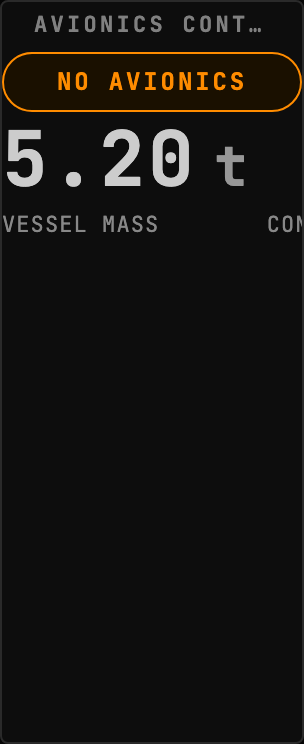
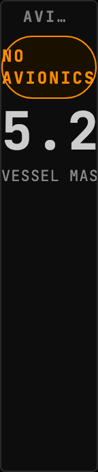
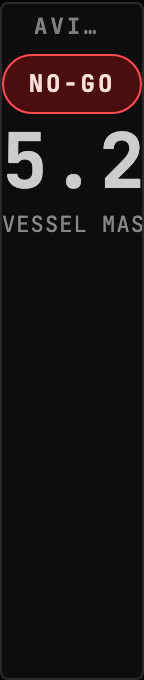
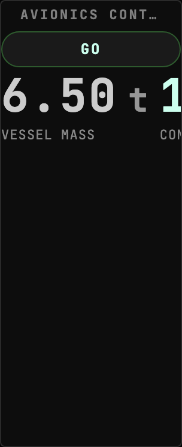
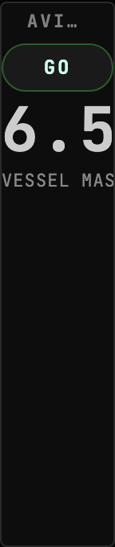

<!-- Generated by `gonogo-uplink docs`. Do not edit this file: edit
     `uplink.md` for the prose, and the registrations for everything else. -->

# Avionics

Answers the one question an RP-1 launch turns on: is this vessel light enough for
the avionics unit flying it. The unit has a controllable-mass limit, and a vessel
over it does not fly, so the readout is a go/no-go rather than a gauge.

The mod half never links RP-0's assembly and never derives from its types. Every
RP-1 avionics member is reached by runtime reflection, which keeps this
assembly clear of RP-1's NonCommercial ShareAlike terms; RP-1's attribution
notice ships beside the plugin in `NOTICE-RP1.txt`.

## Install

Needs [RP-1](https://github.com/KSP-RO/RP-0) and the Realism Overhaul stack it
sits on. With RP-1 absent the Uplink loads, publishes nothing, and the widget
says it has no reading rather than showing a zero that looks like a real limit.

| | |
| --- | --- |
| Uplink id | `avionics` |
| Version | `0.0.1` |
| Built against | contract 13.2, api 1.0.0, ui-kit 0.2.0 |

## What it puts on the wire

Reflected out of this Uplink's own contract assembly by the codegen that writes `src/__generated__/`, so it describes the C# declaration itself rather than a second copy of it. Each field is followed by its declared unit (a lowercase token from the wire vocabulary) or, where it holds another payload, that payload's name.

### Channels

| Channel | Payload | Fields |
| --- | --- | --- |
| `avionics.status` | `AvionicsStatus` | `avionicsActive` flag, `controllable` flag, `controllableMassTons` t, `vesselMassTons` t |

## Widgets

### Avionics Control

RP-1 ascent controllability: is the vessel mass within the active avionics unit's tonnage limit.

- Widget id: `avionics-go-no-go`
- Needs: `avionics.status`
- Only live while present: `flight`
- Default size: 4 x 4 grid units

*No avionics unit fitted: the vessel mass still reads, the controllable ceiling is a dash rather than a substituted zero*

*No avionics unit fitted: the vessel mass still reads, the controllable ceiling is a dash rather than a substituted zero*

*Vessel heavier than the avionics unit can control: NO-GO, with the controllable ceiling carrying the alert tone*

*Vessel heavier than the avionics unit can control: NO-GO, with the controllable ceiling carrying the alert tone*

*Vessel mass inside the active avionics unit's controllable-mass limit, so the ascent is GO*

*Vessel mass inside the active avionics unit's controllable-mass limit, so the ascent is GO*

## What other mods can extend in this Uplink

Every widget above carries the framework's universal segments (`badges`, `filters`, `meters`), so another mod can add a badge, a filter or a meter to any of them without this Uplink declaring anything. They are not listed per widget: they are the floor every widget stands on, not this Uplink's own extension surface.

## What this page cannot tell you

- which commands the Uplink accepts, and each one's DELAY ROLE. Both are
  declared where the mod registers them rather than as an attribute on a
  payload, and the client sends a command by naming it at the call site,
  so neither half of the build can enumerate them
- capabilities the mod half declares, which are registered imperatively
  rather than as a field, so nothing can enumerate them
- what a widget DOES, as opposed to what it reads. That is the one thing
  only its author can write, and `uplink.md` is where it goes

