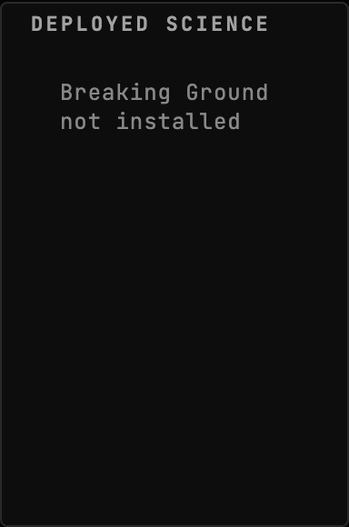
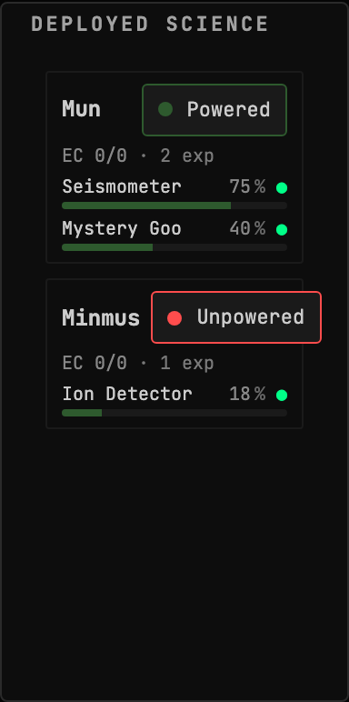
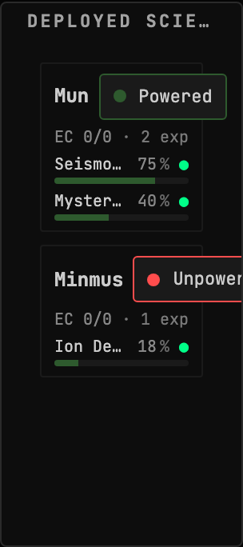
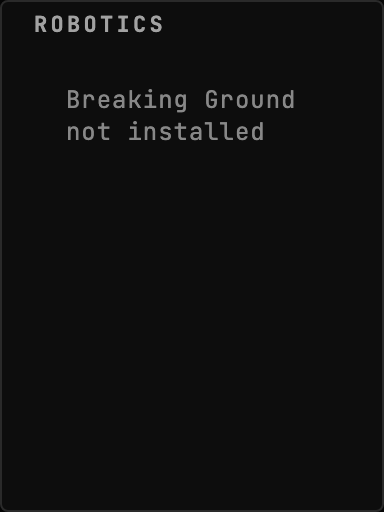
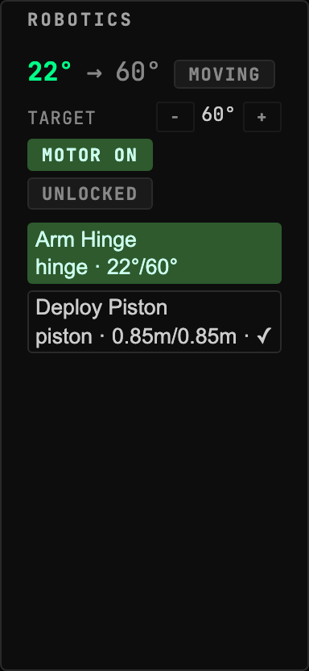
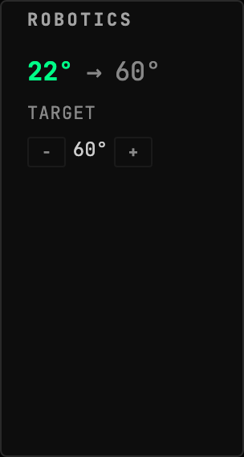
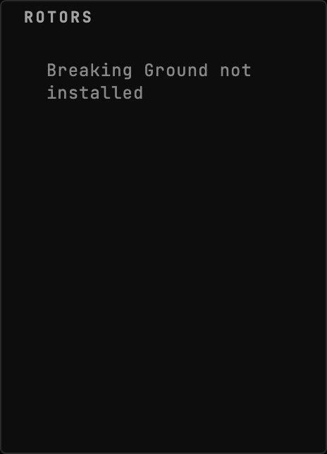
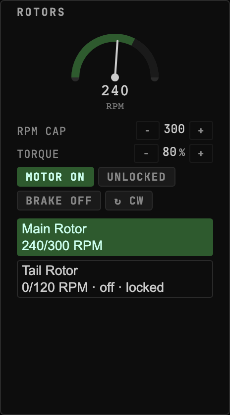
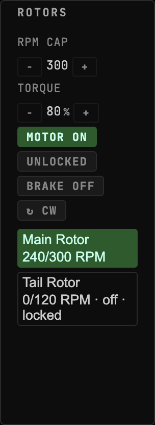

<!-- Generated by `gonogo-uplink docs`. Do not edit this file: edit
     `uplink.md` for the prose, and the registrations for everything else. -->

# Breaking Ground

Puts the Breaking Ground DLC's two mechanical systems on the dashboard: the
robotic joints you drive, and the deployed surface bases that keep working after
you have flown somewhere else.

Robotics is the half that needs a console. A hinge, a rotation servo, a piston
and a rotor each have a current position, a target, a motor and a lock, and
driving one from the in-game part menu means finding the part first. Here you
pick a joint and drive it, from the stepper or from a mapped physical input, and
the current-versus-target pair tells you whether it is still moving.

Deployed science is the half that needs remembering. A surface base on another
body produces while you are not looking at it, and its power balance is what
decides whether it keeps producing. Both are reported for every body at once,
read-only, so a base going dark is something you see rather than something you
discover on your next visit.

## Install

Needs the Breaking Ground expansion, which is a Squad DLC rather than a CKAN
mod. Without it the Uplink loads and publishes nothing, and the widgets say they
have no parts rather than rendering an empty console.

| | |
| --- | --- |
| Uplink id | `breakingGround` |
| Version | `0.0.1` |
| Built against | contract 13.2, api 1.0.0, ui-kit 0.2.0 |

## Widgets

### Deployed Science

Power balance and per-experiment science progress for Breaking Ground deployed surface bases on every body, reported even while you fly something else. Read-only.

- Widget id: `deployed-science`
- Needs: `deployed.bases`, `game.dlc.breakingGround`
- Other mods may render into: `deployed-science.experiment`
- Default size: 5 x 9 grid units

*Breaking Ground not installed: the empty state names the missing DLC rather than reporting an empty roster*

> Empty by design: There is no deployed science without the DLC. The whole subject of the scene is the sentence the widget shows in its place, and it must not read as 'nothing planted yet'.

*Duna base with no controller connection: progress bars still carry their fill, so the state has to read off the power indicator. The experiment name is deliberately long enough to reach the `Truncate`, which is what an operator sees for most real Breaking Ground part names at this tile*

*Duna base with no controller connection: progress bars still carry their fill, so the state has to read off the power indicator. The experiment name is deliberately long enough to reach the `Truncate`, which is what an operator sees for most real Breaking Ground part names at this tile*

*A powered Mun base with two experiments collecting, above a Minmus base that has lost power overnight*

*A powered Mun base with two experiments collecting, above a Minmus base that has lost power overnight*

### Robotics Console

Current-vs-target position, at-target state and motor/lock controls for Breaking Ground robotic hinges, rotation servos and pistons. Select a joint to drive it from the stepper or a mapped input.

- Widget id: `robotics-console`
- Needs: `robotics.servos`, `robotics.available.available`
- Can be driven by: `targetUp`, `targetDown`, `toggleMotor`, `toggleLock` (serial input)
- Only live while present: `flight`
- Default size: 5 x 8 grid units

*Breaking Ground not installed: the console names the missing DLC rather than reporting a craft with no joints on it*

> Empty by design: There are no robotic parts without the DLC. The subject of the scene is the sentence the console shows in their place, which must not read as 'this craft has no servos'.

*A hinge driving towards its target, a piston already at one, and a locked rotor the console leaves to the tachometer*

*A hinge driving towards its target, a piston already at one, and a locked rotor the console leaves to the tachometer*

### Rotor Tachometer

Live RPM vs commanded cap for Breaking Ground robotic rotors, with motor, lock, brake and direction controls. Select a rotor to drive it from the dial or a mapped input.

- Widget id: `rotor-tachometer`
- Needs: `robotics.servos`, `robotics.available.available`
- Can be driven by: `rpmUp`, `rpmDown`, `toggleMotor`, `toggleLock`, `reverse` (serial input)
- Only live while present: `flight`
- Default size: 6 x 10 grid units

*Breaking Ground not installed: the dial is withheld entirely rather than drawn at zero RPM*

> Empty by design: There are no rotors without the DLC. A dial parked at 0 RPM would read as a rotor that is stopped, which is a reading; this scene exists to show that none is drawn.

*Main rotor turning near its commanded cap, tail rotor stopped with the brake full on and the servo locked*

*Main rotor turning near its commanded cap, tail rotor stopped with the brake full on and the servo locked*

## What other mods can extend in this Uplink

Slots these widgets declare:

| Slot | Kind | In |
| --- | --- | --- |
| `deployed-science.experiment` | section | Deployed Science |

On top of those, every widget above carries the framework's universal segments (`badges`, `filters`, `meters`), so another mod can add a badge, a filter or a meter to any of them without this Uplink declaring anything. They are not listed per widget: they are the floor every widget stands on, not this Uplink's own extension surface.

## What this page cannot tell you

- capabilities the mod half declares, which are registered imperatively
  rather than as a field, so nothing can enumerate them
- what a widget DOES, as opposed to what it reads. That is the one thing
  only its author can write, and `uplink.md` is where it goes

