<!-- Generated by `gonogo-uplink docs`. Do not edit this file: edit
     `uplink.md` for the prose, and the registrations for everything else. -->

# Aerodynamics

Brings a full-fidelity aerodynamic model's own numbers to the flight board:
angle of attack, sideslip, stall fraction, lift and drag, as
[Ferram Aerospace Research](https://github.com/dkavolis/Ferram-Aerospace-Research)
computes them rather than as stock KSP approximates them.

Under FAR the aerodynamic state is the thing that ends a launch, and it is not
visible from the stock instruments. An ascent that is one degree of angle of
attack from a stall reads the same on a navball as one that is not, and the
first is a lost vehicle. The widget's job is to make the margin legible while
there is still time to fly out of it.

The mod half never links `FerramAerospaceResearch.dll` and never derives from
its types. Every FAR member is reached by runtime reflection, which keeps this
assembly clear of any ShareAlike obligation; FAR's attribution notice ships
beside the plugin in `NOTICE-FAR.txt`.

## Install

Needs [FAR](https://github.com/dkavolis/Ferram-Aerospace-Research), through CKAN
or by hand. With FAR absent the Uplink loads and publishes nothing, and the
widget says there is no reading for this vessel rather than showing stock numbers
under a FAR heading.

| | |
| --- | --- |
| Uplink id | `aero` |
| Version | `0.0.1` |
| Built against | contract 13.2, api 1.0.0, ui-kit 0.2.0 |

## What it puts on the wire

Reflected out of this Uplink's own contract assembly by the codegen that writes `src/__generated__/`, so it describes the C# declaration itself rather than a second copy of it. Each field is followed by its declared unit (a lowercase token from the wire vocabulary) or, where it holds another payload, that payload's name.

### Channels

| Channel | Payload | Fields |
| --- | --- | --- |
| `aero.state` | `AeroState` | `aeroModelValid` flag, `angleOfAttack` °, `ballisticCoefficient` kg/m², `dragCoefficient` 1, `dragForce` kN, `equivalentAirspeed` m/s, `indicatedAirspeed` m/s, `liftCoefficient` 1, `liftForce` kN, `liftToDragRatio` 1, `referenceArea` m², `sideslip` °, `specificExcessPower` W/kg, `stallFraction` ratio, `terminalVelocity` m/s |

## Widgets

### Aerodynamics

Angle of attack, sideslip, stall, lift and drag: the aerodynamic state a full-fidelity aerodynamics model computes.

- Widget id: `aero-state`
- Needs: `aero.state`
- Only live while present: `flight`
- Default size: 4 x 7 grid units

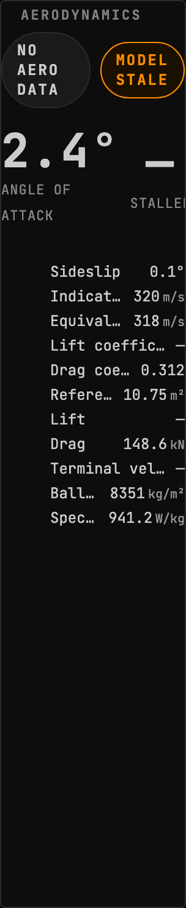

*Launch vehicle through max q, one tick after separation: no wing, so no stall fraction or lift, and the model is flagged stale*

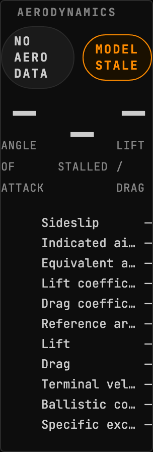

*No aerodynamic reading at all: every field absent, and absence drawn as absence rather than as a run of zeroes*

> Empty by design: This scene IS the absent case, so it renders the same fed and starved by construction: a payload of nothing but nulls and no payload at all are the same picture, and that identity is the property being photographed. What must be visible is that the widget says NO AERO DATA and leaves eleven dashes rather than eleven zeroes, which a reader can check in the image.

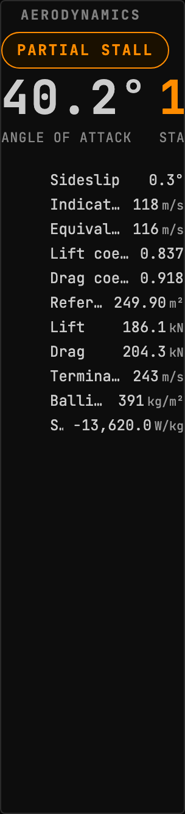

*Re-entry at 40° alpha: partial stall, lift and drag near parity, indicated airspeed far below true*

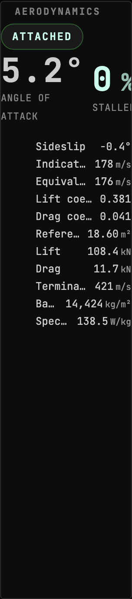

*Winged vehicle in a clean subsonic climb: attached flow, every field on the Topic populated*

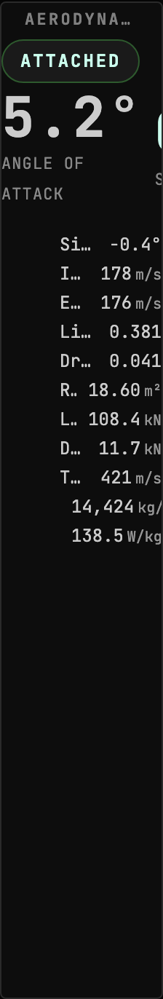

*Winged vehicle in a clean subsonic climb: attached flow, every field on the Topic populated*

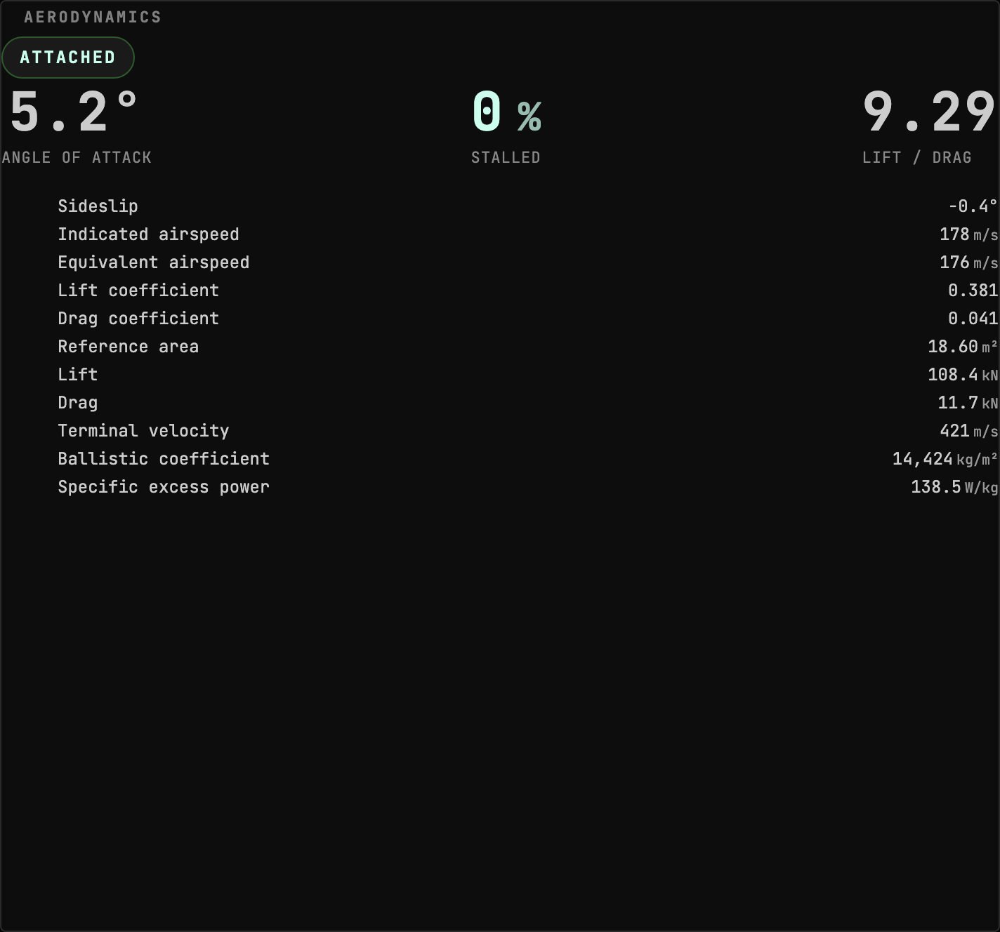

*Winged vehicle in a clean subsonic climb: attached flow, every field on the Topic populated*

## Data contributed to other widgets

### `aero:descent-envelope` into `plots`

- Computed from: `aero.state`, `vessel.landing`, `vessel.flight`, `vessel.surface`, `vessel.identity`, `system.bodies`
- Only while present: `aero`

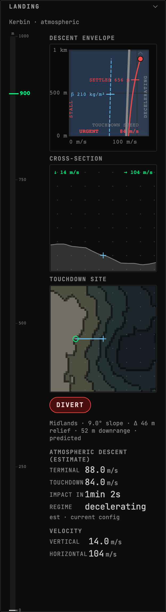

*Atmospheric final approach over a sampled site: ONE descent envelope, carrying the host's terminal corridor and the aero model's own curve merged onto it, beside the same touchdown site and cross-section the vacuum board draws*

*Ballistic capsule, no wings: no STALL word at all because there is no stall fraction to read, and a high ballistic coefficient that puts the settle deep. The plot is the Uplink's own, contributed to `plots`, beside the landing widget's*

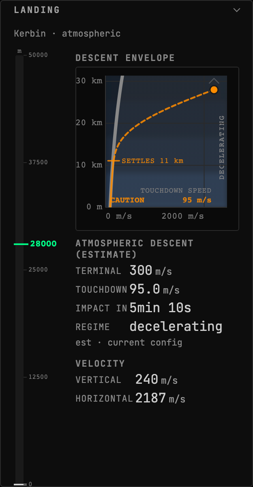

*No aerodynamics model installed: the presence gate stays shut, this Uplink contributes no plot at all, and the landing widget arranges only its own*

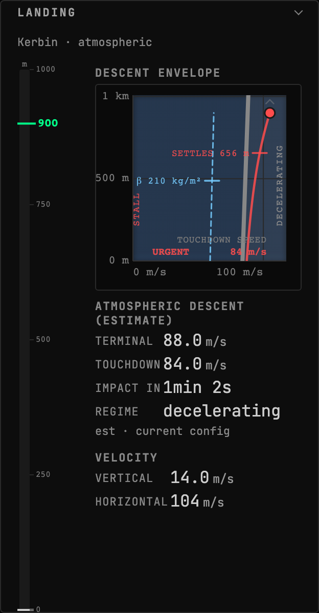

*Subsonic final approach with the wing departing: a solid trace because the transonic region is behind, and STALL up the left edge in the nogo tone*

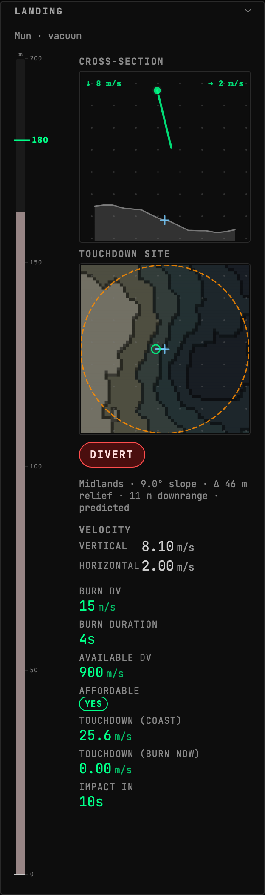

*Mun final approach, no atmosphere: the aero model contributes nothing and there is no descent envelope to contribute to. The touchdown site and the terrain cross-section carry the board, both in metres*

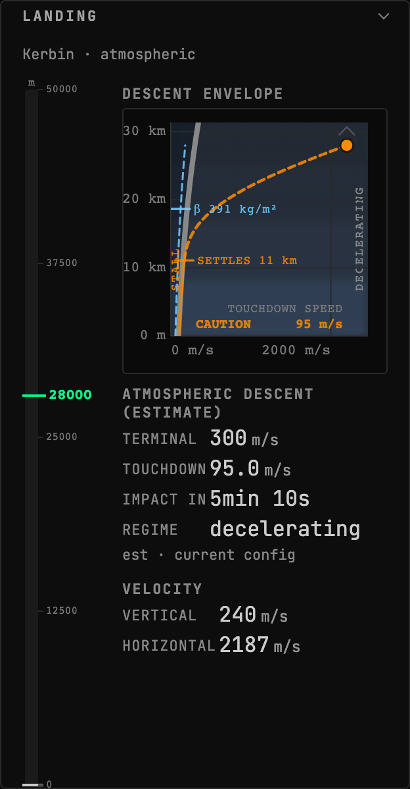

*Winged entry at 40 degrees alpha: the model's own terminal curve parts from the drag back-out it draws beside it, settling the descent higher, with the ballistic coefficient on its tick and STALL up the left edge*

### `aero:descent-envelope-badges` into `landing-status.badges`

- Computed from: `aero.state`
- Only while present: `aero`

*Angle of attack and stall fraction as panel badges: the framework mounts the badge slot for every widget, so this needs nothing added to the landing widget*

## What other mods can extend in this Uplink

Every widget above carries the framework's universal segments (`badges`, `filters`, `meters`), so another mod can add a badge, a filter or a meter to any of them without this Uplink declaring anything. They are not listed per widget: they are the floor every widget stands on, not this Uplink's own extension surface.

## What this page cannot tell you

- which commands the Uplink accepts, and each one's DELAY ROLE. Both are
  declared where the mod registers them rather than as an attribute on a
  payload, and the client sends a command by naming it at the call site,
  so neither half of the build can enumerate them
- capabilities the mod half declares, which are registered imperatively
  rather than as a field, so nothing can enumerate them
- what a widget DOES, as opposed to what it reads. That is the one thing
  only its author can write, and `uplink.md` is where it goes

