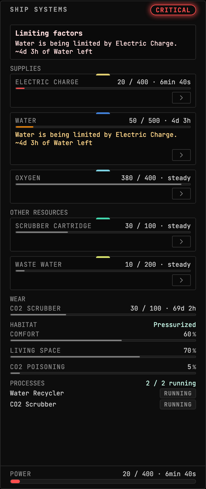
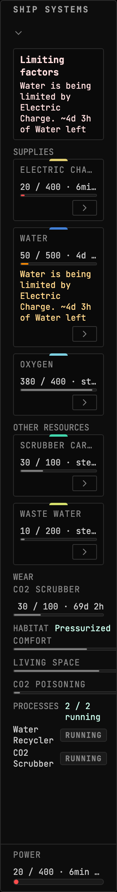
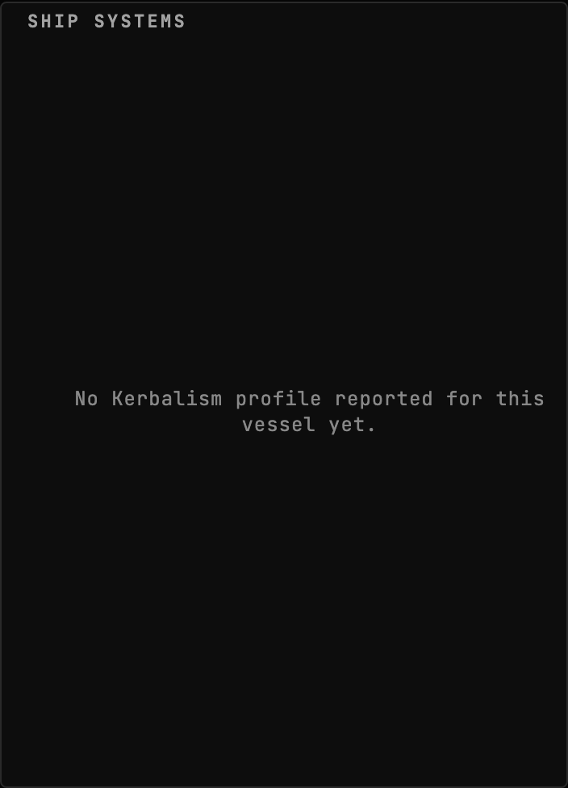
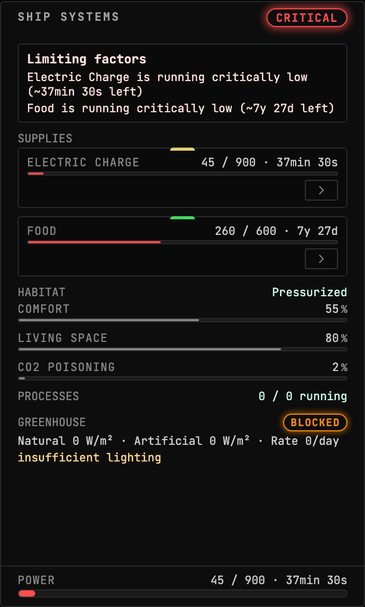
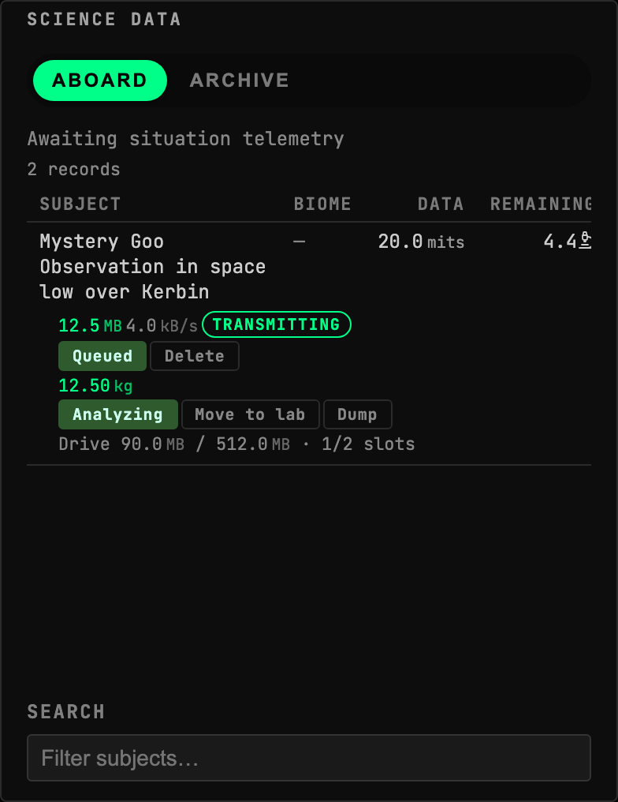
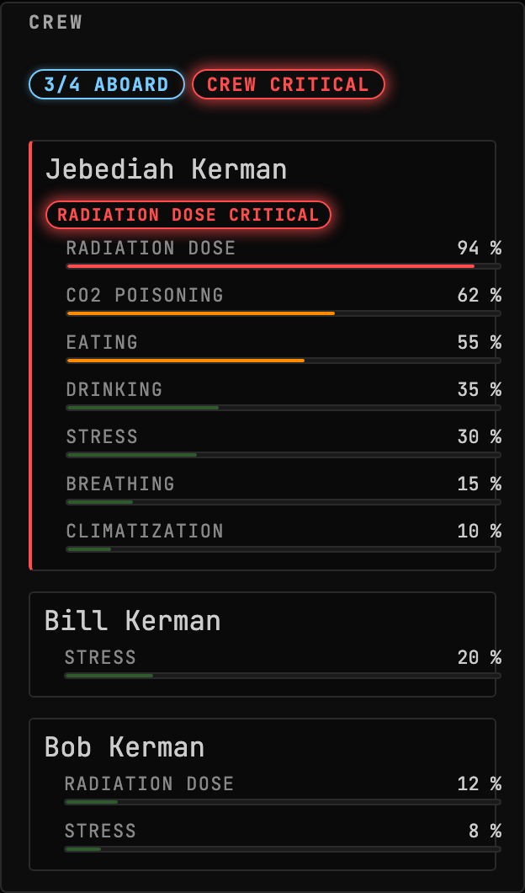

<!-- Generated by `gonogo-uplink docs`. Do not edit this file: edit
     `uplink.md` for the prose, and the registrations for everything else. -->

# Kerbalism

Puts a [Kerbalism](https://github.com/Kerbalism/Kerbalism) vessel's life support
on the dashboard as one ledger: every profile resource as a meter, the per-source
rates that move it, the wear gauges, the habitat, the processes, and the power
that everything else depends on.

Kerbalism kills crews slowly and for reasons that are several steps removed from
the symptom. A greenhouse stops producing because a process stopped, because a
resource ran out, because a converter lost power. A meter alone tells you the
number is falling and not why, so each resource carries the rate ledger of what
is feeding and draining it, and the widget leads with a root-cause line rather
than making you read six gauges and infer one.

The mod half never links Kerbalism's assembly and never derives from its types.
Every member is reached by runtime reflection, so the Uplink loads
presence-safe when Kerbalism is absent; Kerbalism's attribution ships beside the
plugin in `NOTICE-Kerbalism.txt`.

## Install

Needs [Kerbalism](https://github.com/Kerbalism/Kerbalism), through CKAN. With it
absent the Uplink loads, publishes nothing, and the widget says so rather than
rendering empty meters that read as a vessel with no supplies.

| | |
| --- | --- |
| Uplink id | `kerbalism` |
| Version | `0.0.1` |
| Built against | contract 13.2, api 1.0.0, ui-kit 0.2.0 |

## What it puts on the wire

Reflected out of this Uplink's own contract assembly by the codegen that writes `src/__generated__/`, so it describes the C# declaration itself rather than a second copy of it. Each field is followed by its declared unit (a lowercase token from the wire vocabulary) or, where it holds another payload, that payload's name.

### Channels

| Channel | Payload | Fields |
| --- | --- | --- |
| `kerbalism.crew` | `KerbalismCrewEntry[]` | `asOfUt` ut, `deathClockUt` ut, `name` text, `rules` KerbalismCrewRule[], `trait` text |
| `kerbalism.features` | `KerbalismFeatures` | `automation` flag, `comfort` flag, `deploy` flag, `habitat` flag, `livingSpace` flag, `poisoning` flag, `pressure` flag, `radiation` flag, `reliability` flag, `science` flag, `shielding` flag, `spaceWeather` flag, `supplies` flag |
| `kerbalism.lifesupport` | `KerbalismLifeSupport` | `asOfUt` ut, `greenhouses` KerbalismGreenhouseEntry[], `habitat` KerbalismHabitat, `processes` KerbalismProcessEntry[], `rates` units/s, `ruleEnvModifiers` 1 |
| `kerbalism.profile` | `KerbalismProfile` | `name` text, `processes` KerbalismProcessDef[], `resources` *KerbalismResourceDef, `rules` KerbalismRuleDef[] |
| `kerbalism.spaceweather` | `KerbalismSpaceWeather` | `blackout` flag, `habitatRadiationRadPerSecond` rad/s, `inSunlight` flag, `innerBelt` flag, `magnetosphere` flag, `outerBelt` flag, `radiationRadPerSecond` rad/s, `shieldingAmount` units, `shieldingCapacity` units, `stars` KerbalismStarInfo[], `stormEjectionSpeed` m/s, `stormInProgress` flag, `stormIncoming` flag, `storms` KerbalismStormEntry[] |

### Payloads held inside another payload

Reached through a channel above rather than by subscribing to one: a field named in the tables so far holds one of these, either singly, as a list (`[]`) or as a string-keyed dictionary (`*`). Their own fields carry declared units too, which is the reason they are listed: a quantity nested two deep is still a quantity.

| Payload | Fields |
| --- | --- |
| `KerbalismCrewRule` | `degenPerSec` units/s, `fatalThreshold` units, `name` text, `value` units |
| `KerbalismGreenhouseEntry` | `active` flag, `artificial` W/m², `cropResource` text, `ecRateMaxPerSec` units/s, `foodRatePerSec` units/s, `issue` text, `lampEcDrawPerSec` units/s, `lightToleranceWm2` W/m², `natural` W/m², `pressureTolerance` ratio, `radiationToleranceRadPerSec` rad/s |
| `KerbalismHabitat` | `comfort` ratio, `livingSpace` ratio, `poisoning` ratio, `pressure` ratio, `shielding` ratio, `surface` m², `volume` m³ |
| `KerbalismProcessDef` | `dumpValves` text, `inputs` units/s, `modifiers` text, `name` text, `outputs` units/s |
| `KerbalismProcessEntry` | `broken` flag, `capacity` units, `envModifier` 1, `flightId` id, `resource` text, `running` flag, `title` text, `valveIndex` count |
| `KerbalismResourceDef` | `density` kg/m³, `displayName` text, `flowMode` text, `flowModeOrdinal` enum, `isSupply` flag, `lowThreshold` ratio |
| `KerbalismRuleDef` | `breakdown` flag, `degeneration` units/s, `fatalThreshold` units, `input` text, `interval` s, `modifiers` text, `name` text, `output` text, `rate` units, `ratePerSecond` units/s |
| `KerbalismStarInfo` | `direction.x` 1, `direction.y` 1, `direction.z` 1, `distance` m, `star` text |
| `KerbalismStormEntry` | `dist` m, `star` text, `stormDuration` s, `stormState` count, `stormTime` ut, `targetKind` enum, `targetName` text |

### Command args, dynamic channels and extensions

Wire shapes whose route onto the wire is not in the generated slice, so the honest description is all three things one of these can be: a command's arguments, the payload of a dynamic namespace whose topic string is composed at runtime (per vessel, per part, per CPU), or a namespace this Uplink adds inside another channel's extensions bag. None of the three is a fixed name an attribute could declare, which is why they are listed by shape.

| Payload | Fields |
| --- | --- |
| `KerbalismIsruConverterExtension` | `broken` flag, `capacity` units, `processToken` text, `title` text, `valveIndex` count |
| `KerbalismIsruDrillExtension` | `ecRate` units/s, `harvestType` text, `issue` text, `sourceMassRemaining` t, `sourceMassThreshold` t |
| `KerbalismReliabilityExt` | `brokenPartCount` count, `maintenanceDueCount` count, `worstMtbfHours` h |
| `KerbalismResource` | `amount` units, `capacity` units, `rate` units/s |
| `KerbalismScienceBreakdownExt` | `percentCollectedTotal` ratio, `scienceCollectedInFlight` science, `scienceRemainingTotal` science, `timesCompleted` count |
| `KerbalismScienceExperimentExt` | `analyze` flag, `dataSizeMB` MB, `kind` id, `sampleMass` t, `sampleSlotsTotal` count, `sampleSlotsUsed` count, `sciencePerMB` science/MB, `sendFlagged` flag, `storageCapacityMB` MB, `storageUsedMB` MB, `transmitRateMBps` MB/s, `transmitting` flag |
| `KerbalismScienceInstrumentExt` | `bodyCoveragePercent` %, `dataRateMBps` MB/s, `ecRate` units/s, `expStatus` id, `issue` text, `kind` id, `powerDisabled` flag, `prodFactor` ratio, `remainingSampleMass` t, `runningState` id, `scanning` flag |
| `KerbalismScienceLabExt` | `analysisRateMBps` MB/s, `effectiveRateMBps` MB/s, `status` id |
| `KerbalismSubjectActionArgs` | `subjectId` id |
| `KerbalismSubjectFlagArgs` | `flag` flag, `subjectId` id |

## Widgets

### Ship Systems

Vessel-wide Kerbalism resource ledger: root-cause diagnosis, every profile resource as a meter with a per-source rate ledger, wear gauges, habitat, processes, and the power meter.

- Widget id: `ship-systems`
- Needs: `kerbalism.profile`, `kerbalism.lifesupport`, `vessel.resources`, `vessel.crew`
- Other mods may render into: `ship-systems.life-support`
- Only live while present: `flight`
- Default size: 9 x 15 grid units

*Electric Charge short and named as the limiting factor, with the Water shortage it explains sorted underneath it*

*Electric Charge short and named as the limiting factor, with the Water shortage it explains sorted underneath it*

*Telemetry arrived, no profile for this vessel: the panel names that state rather than sitting on the waiting message or drawing empty meters*

> Empty by design: There is nothing to meter on a vessel with no Kerbalism profile. The subject IS the sentence in place of the ledger, and the render has to show it is the 'no profile' one rather than the 'still waiting' one.

## Sections added to other widgets

### `life-support-greenhouse` into `ship-systems.life-support`

- Reads: none

> Rendered in a STAND-IN host panel: the real host widget ships with the app and an Uplink may not import it, so the section's own layout is faithful and how it sits under the host's rows is not shown.

*Greenhouse halted in shadow: the growth rate stops and the row names the reason, while the reason named underneath rather than left to a stopped rate*

### `crew-status-radiation-summary` into `crew-status.summary`

- Reads: none
- Only while present: `kerbalism`

> No preview: no fixture names this augment. An augment that draws in its host's own coordinate space (a map projection, an SVG transform) cannot honestly be shown in a stand-in panel, which has nothing to draw against; one that renders ordinary content can gain a preview by adding a fixture.

### `crew-status-survival-badge` into `crew-status.row-badges`

- Reads: none
- Only while present: `kerbalism`

> No preview: no fixture names this augment. An augment that draws in its host's own coordinate space (a map projection, an SVG transform) cannot honestly be shown in a stand-in panel, which has nothing to draw against; one that renders ordinary content can gain a preview by adding a fixture.

### `science-data-aboard-row-file-manager` into `science-data.aboard-row`

- Reads: none
- Only while present: `kerbalism`

> Rendered in a STAND-IN host panel: the real host widget ships with the app and an Uplink may not import it, so the section's own layout is faithful and how it sits under the host's rows is not shown.

*File Manager controls under a Science Data Aboard row: one subject carrying a file and a sample, so every verb the augment knows renders at once*

## Data contributed to other widgets

### `kerbalism:ship-systems-badge` into `ship-systems.badges`

- Computed from: `processor:kerbalism:ship-systems`
- Only while present: `flight`

### `kerbalism:crew-survival-meters` into `crew-status.meters`

- Computed from: `processor:kerbalism:crew-survival`
- Only while present: `kerbalism`

*Per-kerbal survival meters contributed into Crew Status: one kerbal near a fatal radiation dose, one on a death clock, one healthy*

### `kerbalism:crew-survival-badge` into `crew-status.badges`

- Computed from: `processor:kerbalism:crew-survival`
- Only while present: `kerbalism`

### `kerbalism:crew-survival-row-tone` into `crew-status.row-tone`

- Computed from: `processor:kerbalism:crew-survival`
- Only while present: `kerbalism`

### `kerbalism:space-weather-badge` into `space-weather.badges`

- Computed from: `kerbalism.spaceweather`
- Only while present: `kerbalism`

### `kerbalism:system-view-cme` into `system-view.entities`

- Computed from: `kerbalism.spaceweather`
- Only while present: `kerbalism`

### `kerbalism:ship-map-part-meta` into `ship-map.part-meta`

- Computed from: `kerbalism.lifesupport`
- Only while present: `kerbalism`

### `kerbalism:ship-map-part-meters` into `ship-map.part-meters`

- Computed from: `vessel.parts`, `kerbalism.profile`
- Only while present: `kerbalism`

### `kerbalism:resource-ops-processes` into `resource-ops.filters`

- Computed from: `isru.converters`
- Only while present: `kerbalism`

## What other mods can extend in this Uplink

Slots these widgets declare:

| Slot | Kind | In |
| --- | --- | --- |
| `ship-systems.life-support` | section | Ship Systems |

On top of those, every widget above carries the framework's universal segments (`badges`, `filters`, `meters`), so another mod can add a badge, a filter or a meter to any of them without this Uplink declaring anything. They are not listed per widget: they are the floor every widget stands on, not this Uplink's own extension surface.

## Models and derived data

- processor: `kerbalism:ship-systems`
- processor: `kerbalism:crew-survival`
- derived channel: `kerbalism.resourceProjection`

## What this page cannot tell you

- which topic each of the 10 shapes under
  "Command args, dynamic channels and extensions" travels on. A dynamic
  namespace composes its topic per subject at runtime and an extensions
  bag has no topic of its own, so there is no fixed name for the codegen
  to reflect; the mod's own channel constants are where those strings live
- which commands the Uplink accepts, and each one's DELAY ROLE. Both are
  declared where the mod registers them rather than as an attribute on a
  payload, and the client sends a command by naming it at the call site,
  so neither half of the build can enumerate them
- capabilities the mod half declares, which are registered imperatively
  rather than as a field, so nothing can enumerate them
- what a widget DOES, as opposed to what it reads. That is the one thing
  only its author can write, and `uplink.md` is where it goes

