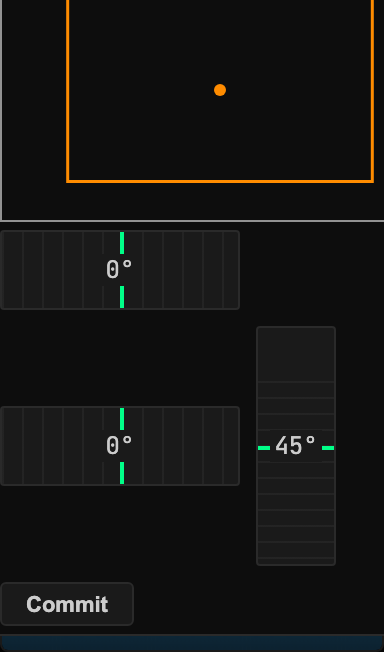
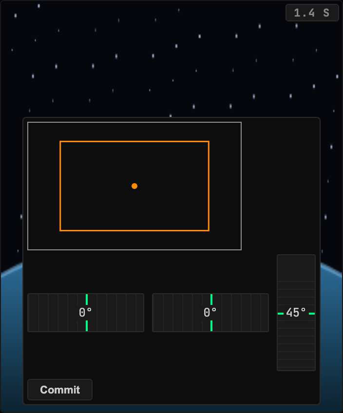
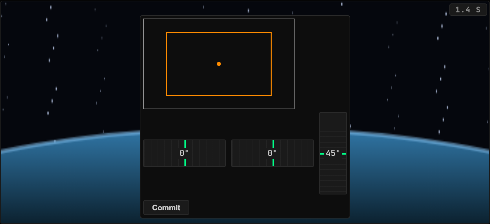
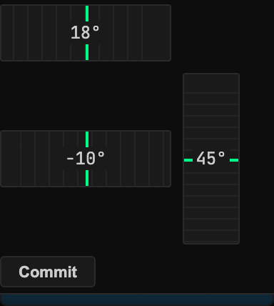
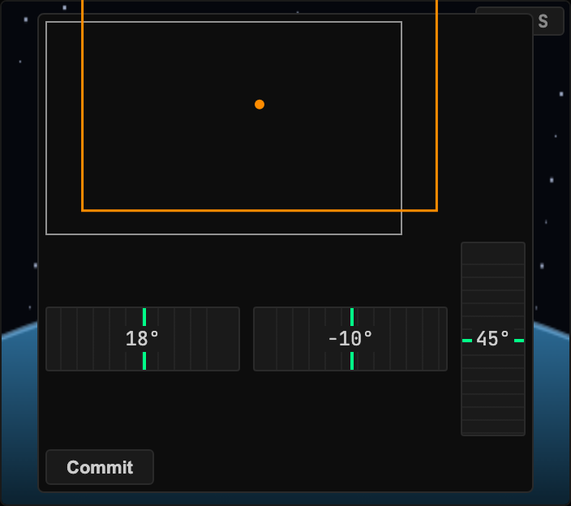
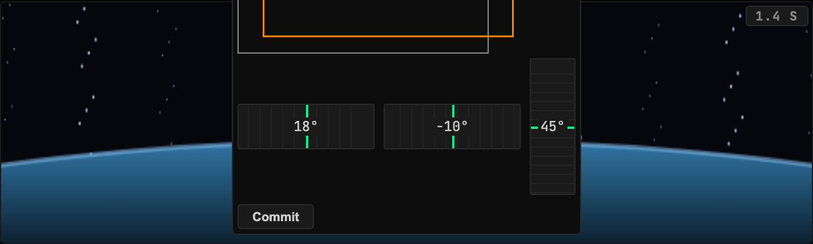

<!-- Generated by `gonogo-uplink docs`. Do not edit this file: edit
     `uplink.md` for the prose, and the registrations for everything else. -->

# Kerbcast

Puts live in-flight camera views on the dashboard, fed by
[kerbcast](https://github.com/jonpepler/kerbcast), the KSP camera-streaming
sidecar. Cameras come from Hullcam VDS parts on the flying vessel, with a picker
and Next/Previous switching in the widget, and crew faces can be shown in the
CrewStatus avatars.

## Two planes, and only one of them rides the Uplink

Camera CONTROL rides the Uplink like any other: the inventory, each camera's
capabilities, its docking-port association, health, and the aim and zoom
commands. Camera VIDEO does not ride it at all, and that split is deliberate. A
keyframed telemetry channel is the wrong shape for encoded media, so video stays
on kerbcast's own WebRTC path. The two planes join on the camera id, which is
kerbcast's own flight id for the same part.

The practical consequence is that a camera can be listed and controllable while
its video is not up, and the widget distinguishes the two rather than showing one
blank rectangle for both.

The mod half never links kerbcast's assembly and never derives from its types.
Every member is reached by runtime reflection, which keeps this assembly clear of
kerbcast's NonCommercial ShareAlike terms; its attribution notice ships beside
the plugin in `NOTICE-KERBCAST.txt`.

## Install

Needs the kerbcast sidecar running and reachable, and Hullcam VDS parts on the
vessel you want to see. The sidecar's host and port are configurable from the
Data Sources panel. With no sidecar the Uplink loads and the widget says it has
no cameras rather than showing a dead frame.

| | |
| --- | --- |
| Uplink id | `kerbcast` |
| Version | `0.0.1` |
| Built against | contract 13.2, api 1.0.0, ui-kit 0.2.0 |

## What it puts on the wire

Reflected out of this Uplink's own contract assembly by the codegen that writes `src/__generated__/`, so it describes the C# declaration itself rather than a second copy of it. Each field is followed by its declared unit (a lowercase token from the wire vocabulary) or, where it holds another payload, that payload's name.

### Channels

| Channel | Payload | Fields |
| --- | --- | --- |
| `kerbcast.cameras` | `KerbcastCameraEntry[]` | `cameraId` id, `cameraName` text, `dockingPortNodeType` text, `dockingPortState` text, `fieldOfView` °, `fieldOfViewMaximum` °, `fieldOfViewMinimum` °, `isDockingCamera` flag, `panPitch` °, `panPitchMaximum` °, `panPitchMinimum` °, `panYaw` °, `panYawMaximum` °, `panYawMinimum` °, `partId` id, `partName` text, `partTitle` text, `supportsPan` flag, `supportsZoom` flag, `vesselId` id |

### Command args, dynamic channels and extensions

Wire shapes whose route onto the wire is not in the generated slice, so the honest description is all three things one of these can be: a command's arguments, the payload of a dynamic namespace whose topic string is composed at runtime (per vessel, per part, per CPU), or a namespace this Uplink adds inside another channel's extensions bag. None of the three is a fixed name an attribute could declare, which is why they are listed by shape.

| Payload | Fields |
| --- | --- |
| `KerbcastSetFieldOfViewArgs` | `cameraId` id, `fieldOfView` ° |
| `KerbcastSetPanArgs` | `cameraId` id, `pitch` °, `yaw` ° |

## Widgets

### Camera Feed

Live camera streams from in-flight Hullcam VDS parts, with an in-widget camera picker and Next/Previous switching.

- Widget id: `camera-feed`
- Needs: `vessel.comms`, `comms.link`, `comms.delay`
- Can be driven by: `nextCamera`, `prevCamera`, `zoomIn`, `zoomOut`, `panYaw`, `panPitch` (serial input)
- Other mods may render into: `camera-feed.overlay`
- Default size: 5 x 5 grid units

*A fixed camera, which most are: no aim to give it, so the feed has the whole tile and the header carries the name and the signal delay*

*A fixed camera, which most are: no aim to give it, so the feed has the whole tile and the header carries the name and the signal delay*

*A fixed camera, which most are: no aim to give it, so the feed has the whole tile and the header carries the name and the signal delay*

*A camera that can be aimed: the reticle sits over the live feed, and the pan, pitch and zoom tapes below it are an aim the operator commits rather than one that fires per notch*

*A camera that can be aimed: the reticle sits over the live feed, and the pan, pitch and zoom tapes below it are an aim the operator commits rather than one that fires per notch*

*A camera that can be aimed: the reticle sits over the live feed, and the pan, pitch and zoom tapes below it are an aim the operator commits rather than one that fires per notch*

## Sections added to other widgets

### `kerbcast-crew-avatar` into `crew-status.avatar`

- Reads: none
- Only while present: `kerbcast`

> No preview: no fixture names this augment. An augment that draws in its host's own coordinate space (a map projection, an SVG transform) cannot honestly be shown in a stand-in panel, which has nothing to draw against; one that renders ordinary content can gain a preview by adding a fixture.

### `kerbcast-docking-camera` into `targeting.camera`

- Reads: `kerbcast.cameras`
- Only while present: `kerbcast`

Fills Targeting's camera slot with the close-range docking view, choosing the
camera from the Uplink's own docking-port association rather than asking the
operator which lens is pointing at the port.

Presence-gated, so an install without kerbcast composes that HUD with no video
layer and no cost, rather than reserving space for a picture that is never
coming.

> No preview: no fixture names this augment. An augment that draws in its host's own coordinate space (a map projection, an SVG transform) cannot honestly be shown in a stand-in panel, which has nothing to draw against; one that renders ordinary content can gain a preview by adding a fixture.

## What other mods can extend in this Uplink

Slots these widgets declare:

| Slot | Kind | In |
| --- | --- | --- |
| `camera-feed.overlay` | section | Camera Feed |

On top of those, every widget above carries the framework's universal segments (`badges`, `filters`, `meters`), so another mod can add a badge, a filter or a meter to any of them without this Uplink declaring anything. They are not listed per widget: they are the floor every widget stands on, not this Uplink's own extension surface.

## What this page cannot tell you

- which topic each of the 2 shapes under
  "Command args, dynamic channels and extensions" travels on. A dynamic
  namespace composes its topic per subject at runtime and an extensions
  bag has no topic of its own, so there is no fixed name for the codegen
  to reflect; the mod's own channel constants are where those strings live
- which commands the Uplink accepts, and each one's DELAY ROLE. Both are
  declared where the mod registers them rather than as an attribute on a
  payload, and the client sends a command by naming it at the call site,
  so neither half of the build can enumerate them
- capabilities the mod half declares, which are registered imperatively
  rather than as a field, so nothing can enumerate them
- what a widget DOES, as opposed to what it reads. That is the one thing
  only its author can write, and `uplink.md` is where it goes

