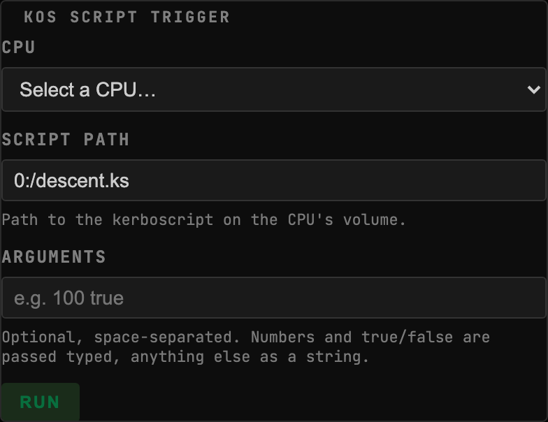
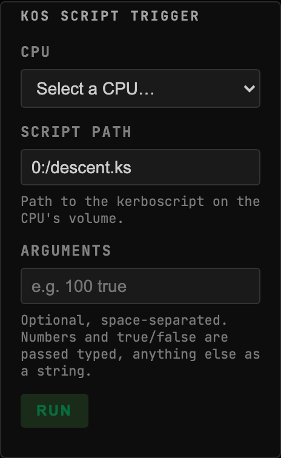
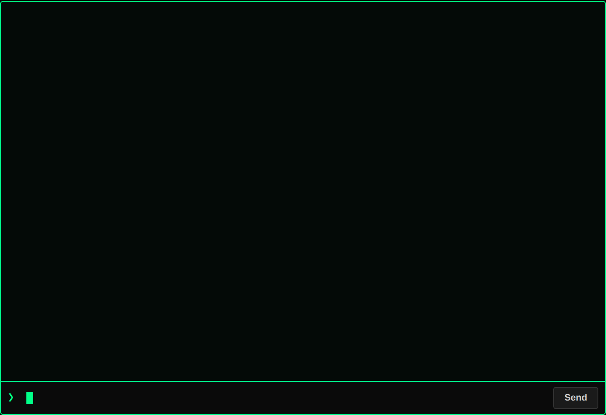
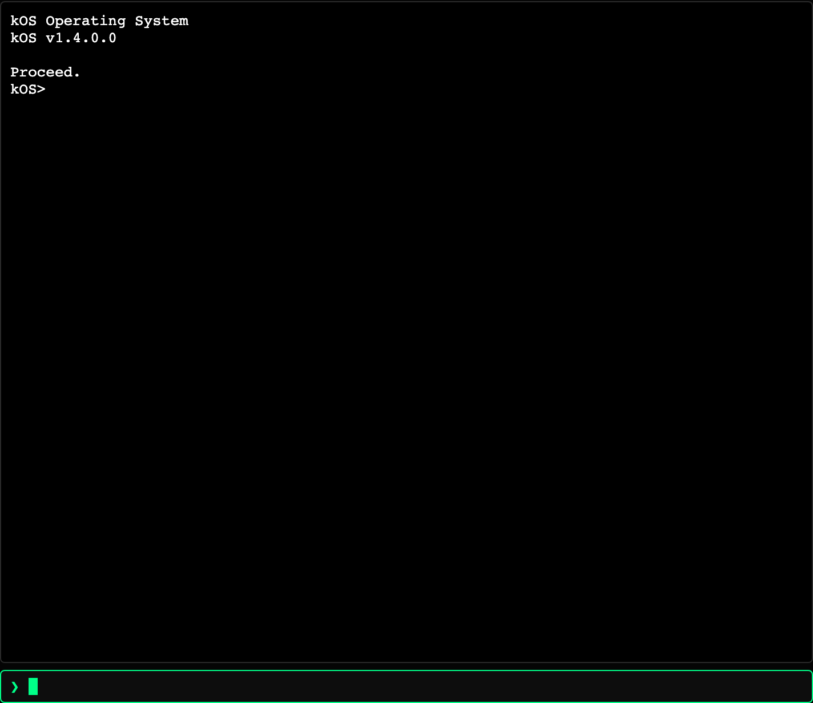

<!-- Generated by `gonogo-uplink docs`. Do not edit this file: edit
     `uplink.md` for the prose, and the registrations for everything else. -->

# kOS

Puts a [kOS](https://github.com/KSP-KOS/KOS) CPU's terminal on the mission-control
dashboard, streamed in process over the Uplink with no proxy to run.

The terminal is the real one: kOS draws its screen as VT bytes and this renders them
with xterm, so what you see is byte-for-byte what the in-game window shows. Keystrokes
go back the other way as commands, which means they are subject to the same signal
delay as everything else, and that is the point rather than a limitation.

## Install

Install kOS through CKAN, then the Gonogo kOS Uplink alongside it. With no kOS CPU in
range the widget says so; it never becomes a hard startup requirement for the app.

| | |
| --- | --- |
| Uplink id | `kos` |
| Version | `0.0.1` |
| Built against | contract 13.2, api 1.0.0, ui-kit 0.2.0 |

## What it puts on the wire

Reflected out of this Uplink's own contract assembly by the codegen that writes `src/__generated__/`, so it describes the C# declaration itself rather than a second copy of it. Each field is followed by its declared unit (a lowercase token from the wire vocabulary) or, where it holds another payload, that payload's name.

### Channels

| Channel | Payload | Fields |
| --- | --- | --- |
| `kos.processors` | `KosProcessorInfo[]` | `bootFilePath` text, `coreId` id, `hasBooted` flag, `partName` text, `processorMode` text, `tag` text |

### Command args, dynamic channels and extensions

Wire shapes whose route onto the wire is not in the generated slice, so the honest description is all three things one of these can be: a command's arguments, the payload of a dynamic namespace whose topic string is composed at runtime (per vessel, per part, per CPU), or a namespace this Uplink adds inside another channel's extensions bag. None of the three is a fixed name an attribute could declare, which is why they are listed by shape.

| Payload | Fields |
| --- | --- |
| `KosComputeStatus` | `lastGoodAt` ut, `parseError` text, `paused` flag, `running` flag, `scriptError` text |
| `KosExecArgs` | `coreId` id, `scriptId` id |
| `KosKeystrokeArgs` | `chars` text, `coreId` id, `leaseToken` id |
| `KosReEnableArgs` | `scriptId` id |
| `KosRunArgs` | `command` text, `coreId` id, `requestId` id |
| `KosRunResult` | `coreId` id, `error` text, `requestId` id |
| `KosTerminalCloseArgs` | `coreId` id, `leaseToken` id |
| `KosTerminalFrame` | `chunk` text, `coreId` id, `fullRepaint` flag |
| `KosTerminalOpenArgs` | `coreId` id, `leaseToken` id |
| `KosTerminalResizeArgs` | `cols` count, `coreId` id, `leaseToken` id, `rows` count |

## Widgets

### kOS Script Trigger

Run a kerboscript on a kOS CPU: pick the CPU, path, and args, dispatch over the Uplink, and see the correlated result or error inline.

- Widget id: `kos-script-trigger`
- Needs: `kos.processors`
- Default size: 10 x 9 grid units

The terminal is for working at a CPU; this is for the script you run the same way
every time. Pin the path in the widget's config and it becomes a button.

Arguments are typed on the way through: `100` arrives as a number and `true` as a
boolean, anything else as a string, so a script taking a burn duration gets one
rather than the characters that spell it.

The result is correlated back to the dispatch, so what you see is the outcome of the
run you started and not the last thing the CPU happened to print. Under light-time
delay it stays in `running` for the whole round trip rather than faking an answer,
and it distinguishes a fault in your script from a failure to reach the CPU at all.

*Two CPUs in range and none pinned, so the widget asks which one to run on rather than guessing*

*Two CPUs in range and none pinned, so the widget asks which one to run on rather than guessing*

### kOS Terminal

Interactive or read-only terminal for a kOS CPU, streamed in-process over the Uplink (no proxy).

- Widget id: `kos-terminal`
- Needs: `kos.processors`
- Default size: 18 x 15 grid units

Attach a terminal to a CPU by its kOS tagname. With exactly one CPU present it
attaches on its own; with several and no tagname it offers a picker rather than
guessing.

Line mode is the setting worth understanding. With it off, every keystroke is its own
command, so under light-time delay a ten-character command is ten round trips and you
watch your own typing arrive minutes later. With it on, the line is composed locally
with instant echo in the bar under the screen and sent as ONE command on Enter. The
composition never touches the terminal screen, so a keyframe repaint arriving
mid-sentence does not eat what you were typing.

Read-only mode forwards nothing at all: a passive downlink view of what the CPU is
doing, for a station screen that should not be able to fly the craft.

*A script running: kOS redraws the screen in chunks and the terminal repaints as they land*

*Attached to the 'lander' CPU with line-mode composition on: what the operator types is held in the bar under the screen until Enter sends it as one command*

## What other mods can extend in this Uplink

Every widget above carries the framework's universal segments (`badges`, `filters`, `meters`), so another mod can add a badge, a filter or a meter to any of them without this Uplink declaring anything. They are not listed per widget: they are the floor every widget stands on, not this Uplink's own extension surface.

## What this page cannot tell you

- which topic each of the 10 shapes under
  "Command args, dynamic channels and extensions" travels on. A dynamic
  namespace composes its topic per subject at runtime and an extensions
  bag has no topic of its own, so there is no fixed name for the codegen
  to reflect; the mod's own channel constants are where those strings live
- which commands the Uplink accepts, and each one's DELAY ROLE. Both are
  declared where the mod registers them rather than as an attribute on a
  payload, and the client sends a command by naming it at the call site,
  so neither half of the build can enumerate them
- capabilities the mod half declares, which are registered imperatively
  rather than as a field, so nothing can enumerate them
- what a widget DOES, as opposed to what it reads. That is the one thing
  only its author can write, and `uplink.md` is where it goes

