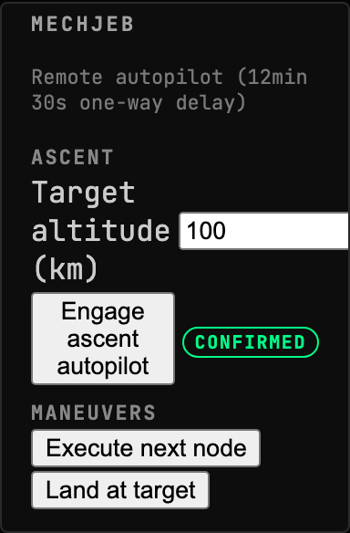
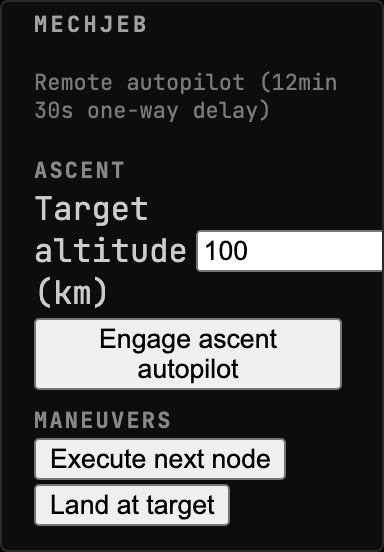
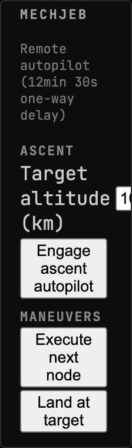
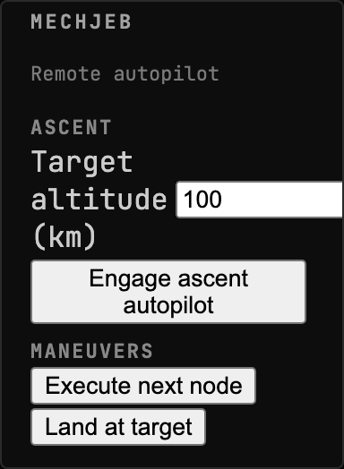
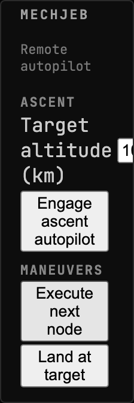

<!-- Generated by `gonogo-uplink docs`. Do not edit this file: edit
     `uplink.md` for the prose, and the registrations for everything else. -->

# MechJeb

Flies the vessel from the console. Engage
[MechJeb2](https://github.com/MuMech/MechJeb2)'s ascent autopilot, execute the
next maneuver node, or land at the selected target, dispatched over the delayed
command path with per-command in-flight state.

The delay is the interesting part. Every one of these is a real command with a
real round trip, so under light-time the widget holds each one in flight for the
whole journey rather than reporting an outcome it cannot know yet. Handing an
autopilot a burn and watching the acknowledgement arrive four minutes later is
what remote flight actually feels like, and the point of driving MechJeb from
here rather than from the in-game window.

This assembly compile-time links MechJeb2 and is licensed GPLv3 to match, the
same rationale as the kOS Uplink. Reflection is used only for the version
guard's presence and shape probe.

## Install

Needs [MechJeb2](https://github.com/MuMech/MechJeb2), through CKAN. With it
absent the Uplink loads, the commands are not offered, and the widget says why
rather than sending commands nothing will answer.

| | |
| --- | --- |
| Uplink id | `mechjeb` |
| Version | `0.0.1` |
| Built against | contract 13.2, api 1.0.0, ui-kit 0.2.0 |

## What it puts on the wire

Reflected out of this Uplink's own contract assembly by the codegen that writes `src/__generated__/`, so it describes the C# declaration itself rather than a second copy of it. Each field is followed by its declared unit (a lowercase token from the wire vocabulary) or, where it holds another payload, that payload's name.

### Channels

This Uplink declares no statically-named channel. Everything it publishes rides a dynamic namespace, whose payloads are below.

### Command args, dynamic channels and extensions

Wire shapes whose route onto the wire is not in the generated slice, so the honest description is all three things one of these can be: a command's arguments, the payload of a dynamic namespace whose topic string is composed at runtime (per vessel, per part, per CPU), or a namespace this Uplink adds inside another channel's extensions bag. None of the three is a fixed name an attribute could declare, which is why they are listed by shape.

| Payload | Fields |
| --- | --- |
| `MechJebAscentArgs` | `targetAltitudeKm` km |

## Widgets

### MechJeb

Remote MechJeb autopilot control (engage ascent, execute next node, land at target) dispatched over the delayed-command path with per-command in-flight state.

- Widget id: `mechjeb`
- Needs: `comms.delay`
- Can be driven by: `engage-ascent`, `execute-node`, `land-at-target` (serial input)
- Only live while present: `flight`
- Default size: 5 x 7 grid units

*Ascent autopilot commanded across a 12.5-minute link: the row that was pressed carries a status chip, the two that were not stay idle*

*Every command idle, with the one-way light time in the subtitle so an operator knows what a press actually costs*

*Every command idle, with the one-way light time in the subtitle so an operator knows what a press actually costs*

*No one-way delay reading: the subtitle says nothing about light time rather than reporting 0.0 s*

> Empty by design: The subject of this scene is a reading that is not there. Nothing on the wire feeds this widget except `comms.delay`, so with its one number absent the render is identical to an unfed one BY DESIGN: what is worth looking at is that the delay sentence is missing rather than zeroed.

*No one-way delay reading: the subtitle says nothing about light time rather than reporting 0.0 s*

> Empty by design: The subject of this scene is a reading that is not there. Nothing on the wire feeds this widget except `comms.delay`, so with its one number absent the render is identical to an unfed one BY DESIGN: what is worth looking at is that the delay sentence is missing rather than zeroed.

## What other mods can extend in this Uplink

Every widget above carries the framework's universal segments (`badges`, `filters`, `meters`), so another mod can add a badge, a filter or a meter to any of them without this Uplink declaring anything. They are not listed per widget: they are the floor every widget stands on, not this Uplink's own extension surface.

## What this page cannot tell you

- which topic the shape under
  "Command args, dynamic channels and extensions" travels on. A dynamic
  namespace composes its topic per subject at runtime and an extensions
  bag has no topic of its own, so there is no fixed name for the codegen
  to reflect; the mod's own channel constants are where those strings live
- which commands the Uplink accepts, and each one's DELAY ROLE. Both are
  declared where the mod registers them rather than as an attribute on a
  payload, and the client sends a command by naming it at the call site,
  so neither half of the build can enumerate them
- capabilities the mod half declares, which are registered imperatively
  rather than as a field, so nothing can enumerate them
- what a widget DOES, as opposed to what it reads. That is the one thing
  only its author can write, and `uplink.md` is where it goes

