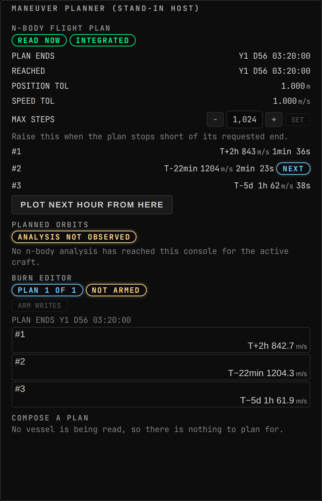
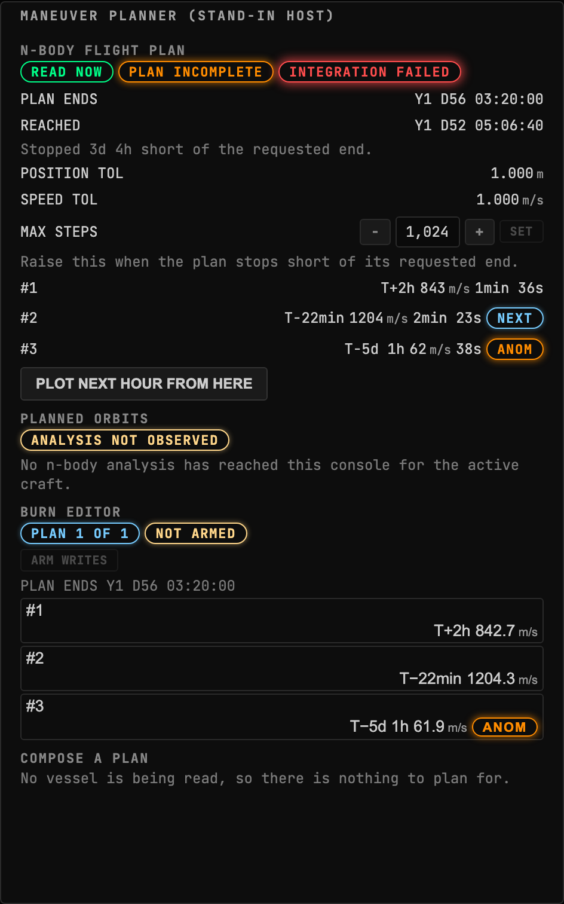
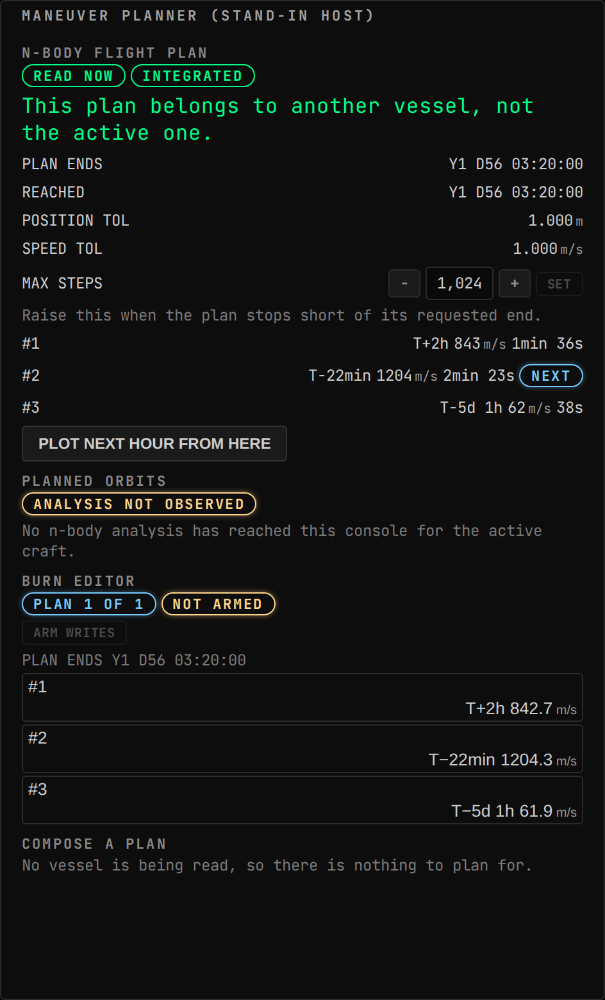
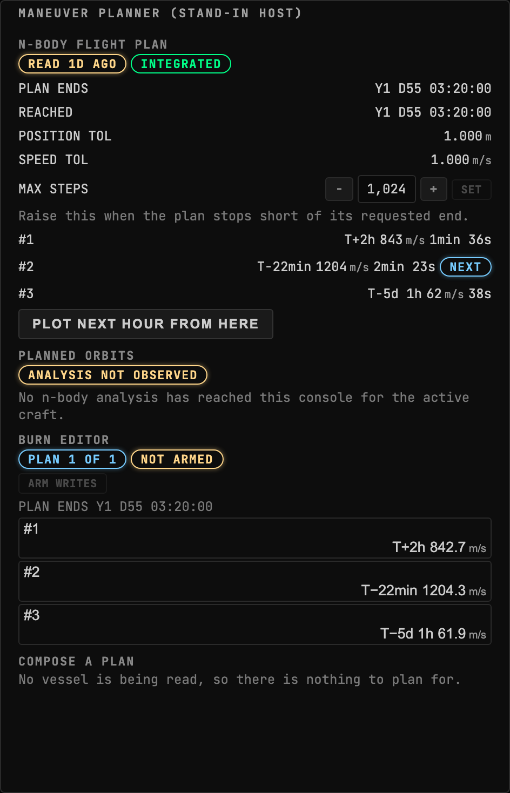
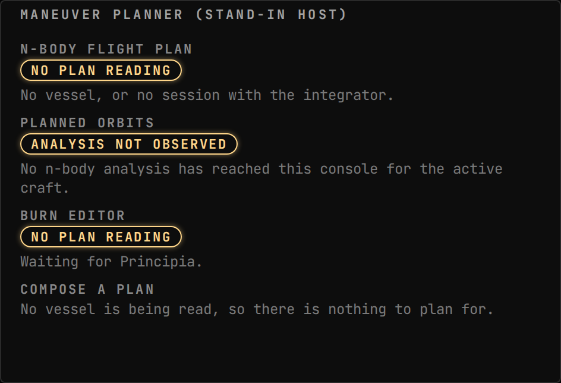
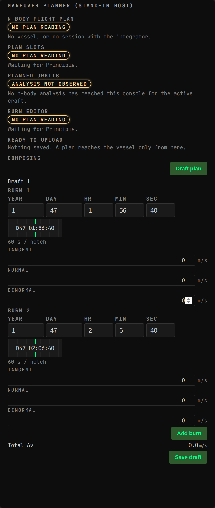
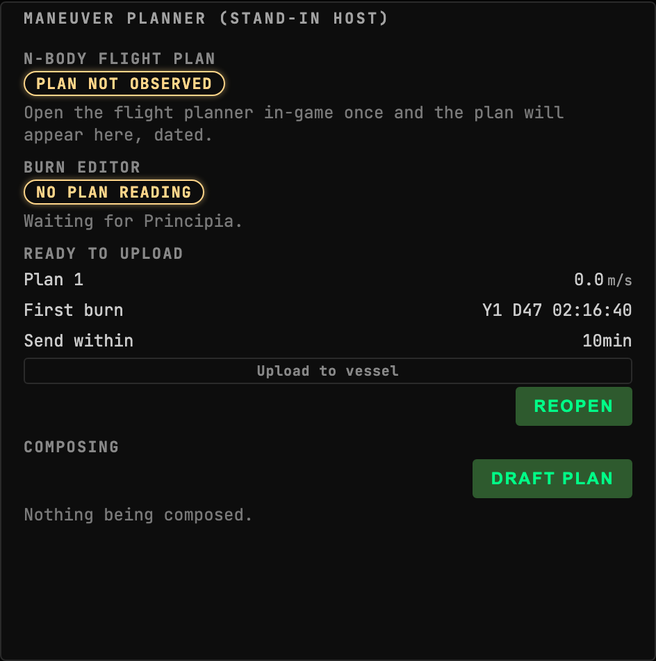
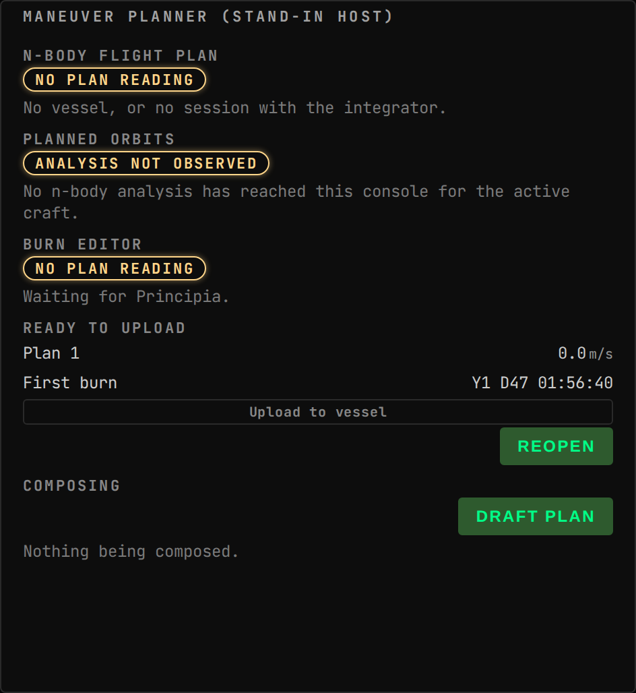
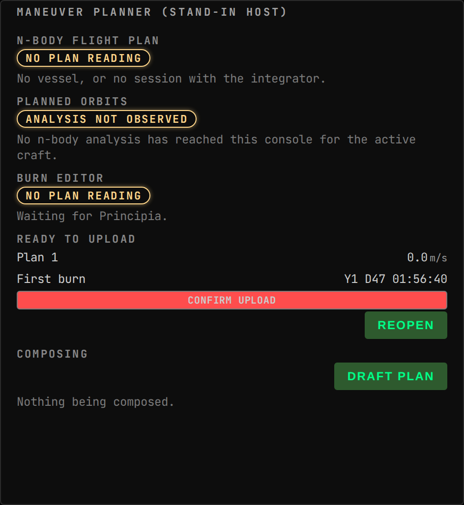
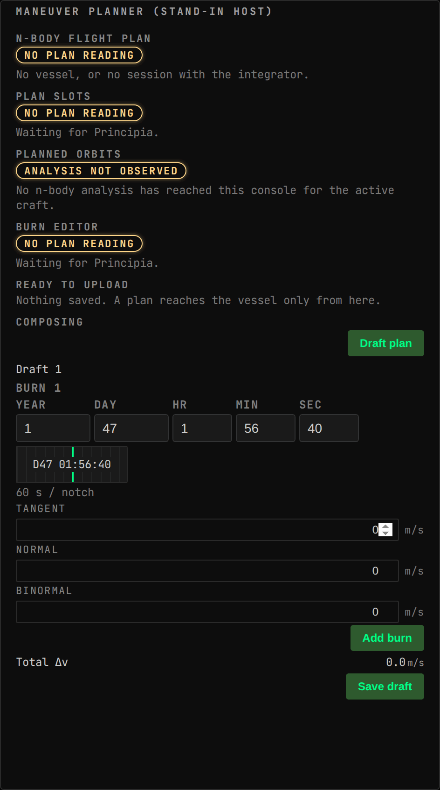

<!-- Generated by `gonogo-uplink docs`. Do not edit this file: it is written
     from the registrations, the contract slice and the fixtures. -->

# Principia

Publishes Principia's n-body state: trajectory arcs, the flight plan and its burns, the reference frame they are expressed in, and the integrator settings.

| | |
| --- | --- |
| Uplink id | `principia` |
| Version | `0.0.1` |
| Built against | contract 13.2, api 1.0.0, ui-kit 0.2.0 |

## Wire

| Topic | Payload | Delivery | Delay |
| --- | --- | --- | --- |
| `principia.flightPlan` | `PrincipiaFlightPlan` | lossy-latest | delayed |
| `principia.plan` | `PrincipiaPlan` | lossy-latest | delayed |
| `principia.settings` | `PrincipiaSettings` | lossy-latest | true-now |

| Payload | Fields |
| --- | --- |
| `PrincipiaBurnEditArgs` | `burnIndex` count, `deltaVBinormal` m/s, `deltaVNormal` m/s, `deltaVTangent` m/s, `ignitionUt` ut, `inertiallyFixed` flag, `requestId` id, `vesselId` id |
| `PrincipiaBurnRemoveArgs` | `burnIndex` count, `requestId` id, `vesselId` id |
| `PrincipiaComposedBurn` | `deltaVBinormal` m/s, `deltaVNormal` m/s, `deltaVTangent` m/s, `ignitionUt` ut, `inertiallyFixed` flag |
| `PrincipiaFlightPlanBurn` | `anomalous` flag, `coordinateSystem` enum, `cutoffUt` ut, `deltaV` m/s, `durationSeconds` s, `ignitionUt` ut, `index` count, `inertiallyFixed` flag, `initialMassTons` t, `specificImpulseSeconds` isp, `thrustKilonewtons` kN |
| `PrincipiaPlanArmArgs` | `requestId` id, `vesselId` id |
| `PrincipiaPlanHorizonArgs` | `desiredFinalTimeUt` ut, `requestId` id, `vesselId` id |
| `PrincipiaPlanIntegrator` | `generalizedIntegratorKind` enum, `integratorKind` enum, `lengthToleranceMetres` m, `maxSteps` count, `speedToleranceMetresPerSecond` m/s |
| `PrincipiaPlanIntegratorArgs` | `lengthToleranceMetres` m, `maxSteps` count, `requestId` id, `speedToleranceMetresPerSecond` m/s, `vesselId` id |
| `PrincipiaPlannedBurn` | `anomalous` flag, `coordinateSystem` enum, `cutoffUt` ut, `deltaV` m/s, `deltaVBinormal` m/s, `deltaVNormal` m/s, `deltaVTangent` m/s, `durationSeconds` s, `executing` flag, `finalMassTons` t, `frameEditable` flag, `frameType` enum, `ignitionUt` ut, `index` count, `inertiallyFixed` flag, `initialMassTons` t, `massFlowKilogramsPerSecond` kg/s, `specificImpulseSeconds` isp, `thrustKilonewtons` kN, `timeToHalfDeltaVSeconds` s |
| `PrincipiaPlanSendArgs` | `burns` PrincipiaComposedBurn[], `composedAtViewUt` ut, `desiredFinalTimeUt` ut, `observedAtUt` ut, `requestId` id, `vesselId` id |
| `PrincipiaPlanSlotArgs` | `finalTimeUt` ut, `requestId` id, `vesselId` id |
| `PrincipiaPlanWriteReceipt` | `plan` PrincipiaPlan, `refusalDetail` text, `replayed` flag, `requestId` id, `statusError` enum, `statusMessage` text |
| `PrincipiaReferenceFrame` | `centreBody` text, `primaryBodies` text, `primaryBody` text, `secondaryBodies` text, `secondaryBody` text, `selector` text, `targetFrameSelected` flag, `targetPrimaryBody` text, `targetVesselId` id, `targetVesselName` text, `type` enum |
| `PrincipiaWriteSurface` | `analysedVersion` text, `armed` flag, `available` flag, `detectedVersion` text, `reason` text |

## Augments

| Augment | Into | Reads | Presence | Notes |
| --- | --- | --- | --- | --- |
| `principia-flight-plan` | `maneuver-planner.sections` | – |  |  |
| `principia-burn-editor` | `maneuver-planner.sections` | – |  |  |
| `principia-plan-composer` | `maneuver-planner.sections` | – |  |  |

