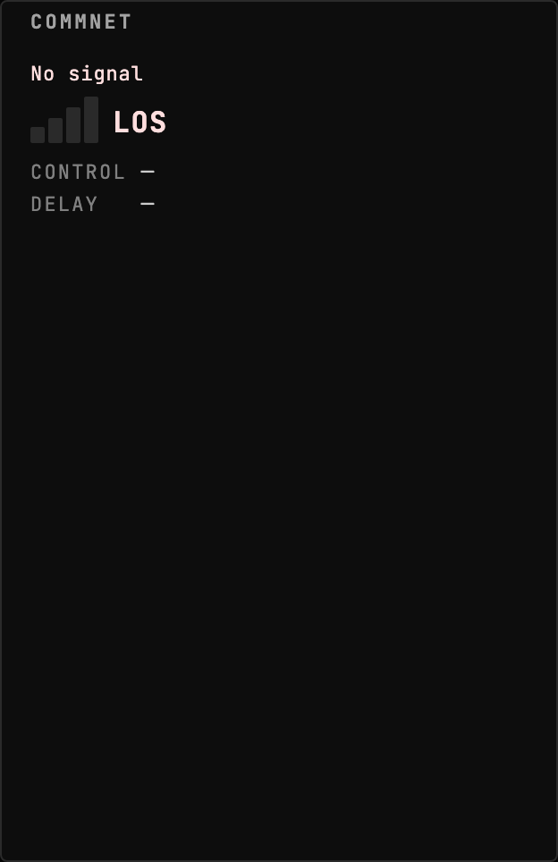
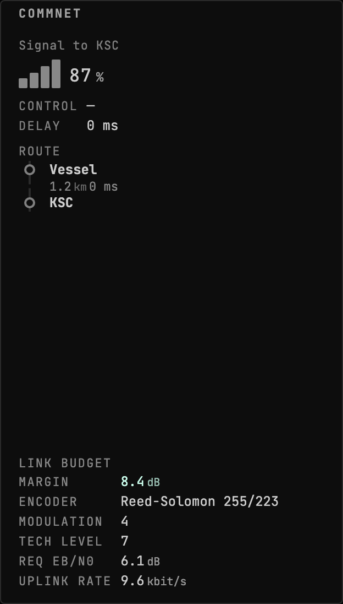
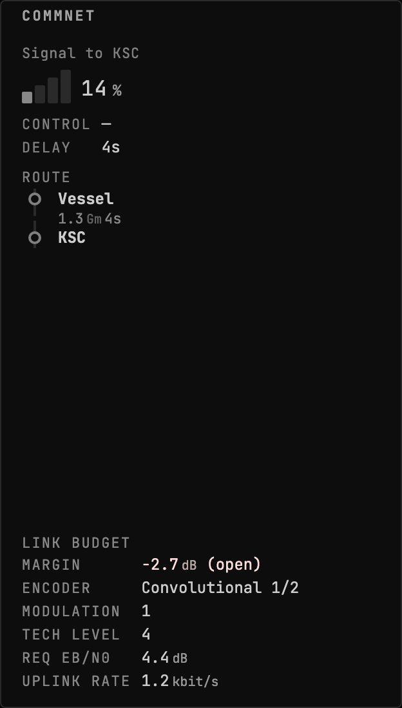
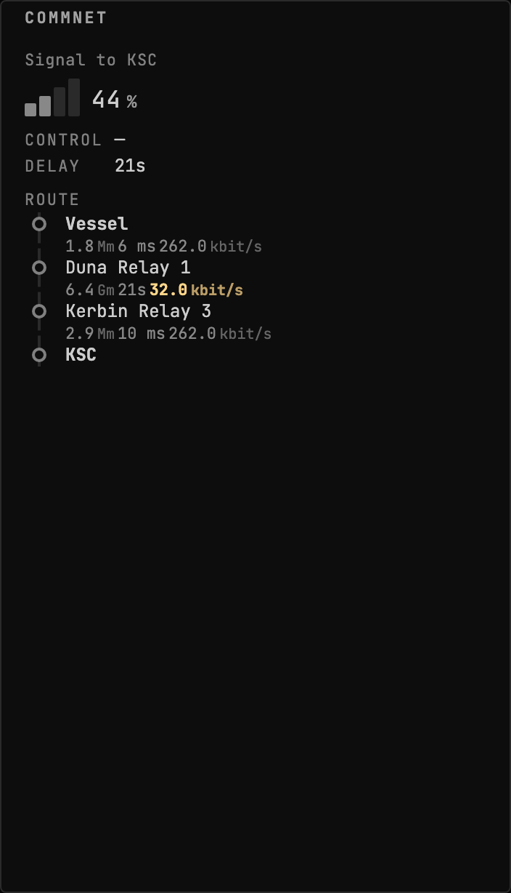

<!-- Generated by `gonogo-uplink docs`. Do not edit this file: edit
     `uplink.md` for the prose, and the registrations for everything else. -->

# RealAntennas

Elects [RealAntennas](https://github.com/KSP-RO/RealAntennas) as the comms
backend when it is installed, so the comms readouts describe the RF link the game
is actually simulating: the link geometry, the data rate, and a re-derived link
margin.

This Uplink adds no widget of its own, and that is the design rather than an
omission. Comms already has a home on the dashboard, so what an RF backend owes
the board is better numbers in the place the operator already looks. It
contributes the per-hop data rates into that widget and adds an RF section and
badge to it, so an install with RealAntennas and one without show the same
widget with different fidelity instead of two competing panels.

The mod half never links RealAntennas' assembly and never derives from its types.
Every member is reached by runtime reflection, which keeps this assembly clear of
RealAntennas' ShareAlike terms; its attribution notice ships beside the plugin in
`NOTICE-REALANTENNAS.txt`.

## Install

Needs [RealAntennas](https://github.com/KSP-RO/RealAntennas), through CKAN. With
it absent the Uplink loads and elects nothing, and the comms widget keeps its
stock CommNet reading: the sections below are presence-gated, so they are simply
not there rather than empty.

| | |
| --- | --- |
| Uplink id | `realantennas` |
| Version | `0.0.1` |
| Built against | contract 13.2, api 1.0.0, ui-kit 0.2.0 |

## What it puts on the wire

Reflected out of this Uplink's own contract assembly by the codegen that writes `src/__generated__/`, so it describes the C# declaration itself rather than a second copy of it. Each field is followed by its declared unit (a lowercase token from the wire vocabulary) or, where it holds another payload, that payload's name.

### Channels

| Channel | Payload | Fields |
| --- | --- | --- |
| `comms.dataRate` | `CommsDataRate` | `downBitsPerSec` bit/s, `upBitsPerSec` bit/s |
| `comms.linkMargin` | `CommsLinkMargin` | `closesLink` flag, `decibelMargin` dB |
| `comms.linkQuality` | `CommsLinkQuality` | `value` ratio |
| `realantennas.hopRates` | `RealAntennasHopRate[]` | `bitsPerSec` bit/s, `fromNodeId` id, `toNodeId` id |

### Command args, dynamic channels and extensions

Wire shapes whose route onto the wire is not in the generated slice, so the honest description is all three things one of these can be: a command's arguments, the payload of a dynamic namespace whose topic string is composed at runtime (per vessel, per part, per CPU), or a namespace this Uplink adds inside another channel's extensions bag. None of the three is a fixed name an attribute could declare, which is why they are listed by shape.

| Payload | Fields |
| --- | --- |
| `RealAntennasHopExt` | `band` text, `beamwidth` °, `codingRate` ratio, `encoder` text, `modulationBits` count, `powerDrawEc` units/s, `requiredEbN0` dB, `reverseBitsPerSec` bit/s, `techLevel` count |

## Sections added to other widgets

### `realantennas-comm-signal-badge` into `comm-signal.badges`

- Reads: `comms.dataRate`, `comms.path`
- Only while present: `realantennas`

> No preview: no fixture names this augment. An augment that draws in its host's own coordinate space (a map projection, an SVG transform) cannot honestly be shown in a stand-in panel, which has nothing to draw against; one that renders ordinary content can gain a preview by adding a fixture.

### `realantennas-comm-signal-section` into `comm-signal.sections`

- Reads: `comms.linkMargin`, `comms.path`
- Only while present: `realantennas`

> Rendered in a STAND-IN host panel: the real host widget ships with the app and an Uplink may not import it, so the section's own layout is faithful and how it sits under the host's rows is not shown.

*RealAntennas installed but the link is dark: the budget section withholds itself entirely rather than showing a labelled blank*

> Empty by design: The subject IS what the augment does not draw. With no margin and no path there is nothing RealAntennas knows, and the honest render is the host composing as if the Uplink were not there. The host is fed, so the frame is not blank.

*RealAntennas' link budget composed into CommSignal: margin closing, with the negotiated encoder, modulation and tech level under it*

*Link budget that does NOT close: a negative margin marked '(open)' rather than left to colour alone*

## Data contributed to other widgets

### `realantennas:comm-signal-hop-rates` into `comm-signal.hop-rates`

- Computed from: `realantennas.hopRates`
- Only while present: `realantennas`

*Per-hop bitrates joined onto CommSignal's route, with the slow middle leg flagged as the bottleneck*

## What this page cannot tell you

- which topic the shape under
  "Command args, dynamic channels and extensions" travels on. A dynamic
  namespace composes its topic per subject at runtime and an extensions
  bag has no topic of its own, so there is no fixed name for the codegen
  to reflect; the mod's own channel constants are where those strings live
- which commands the Uplink accepts, and each one's DELAY ROLE. Both are
  declared where the mod registers them rather than as an attribute on a
  payload, and the client sends a command by naming it at the call site,
  so neither half of the build can enumerate them
- capabilities the mod half declares, which are registered imperatively
  rather than as a field, so nothing can enumerate them
- what a widget DOES, as opposed to what it reads. That is the one thing
  only its author can write, and `uplink.md` is where it goes

