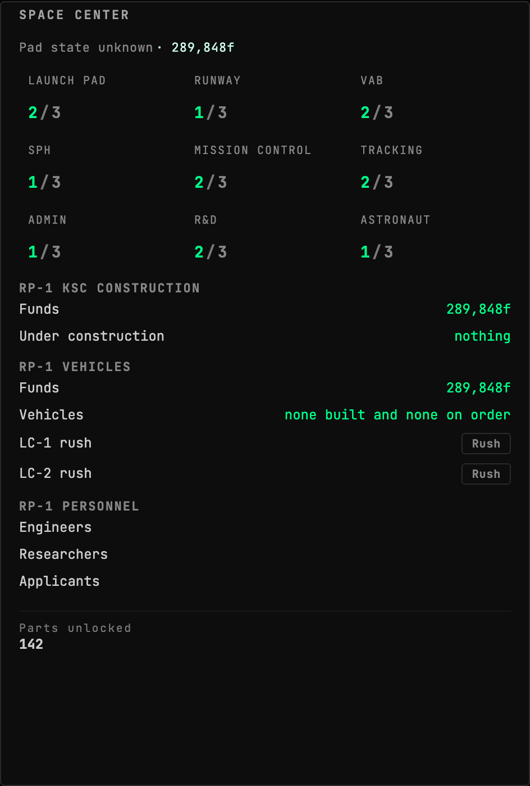
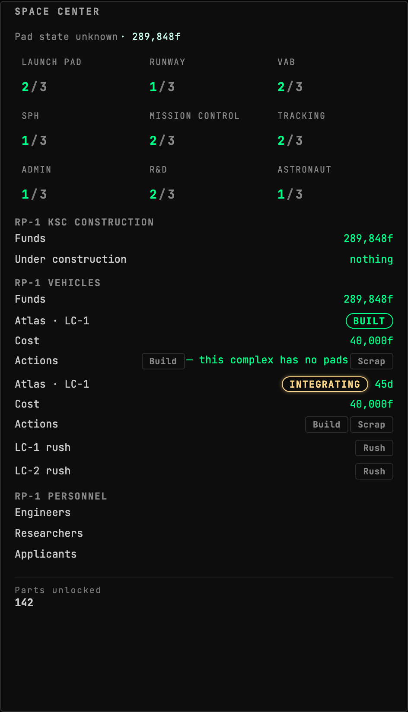
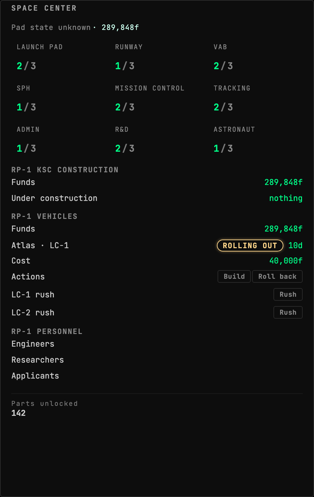
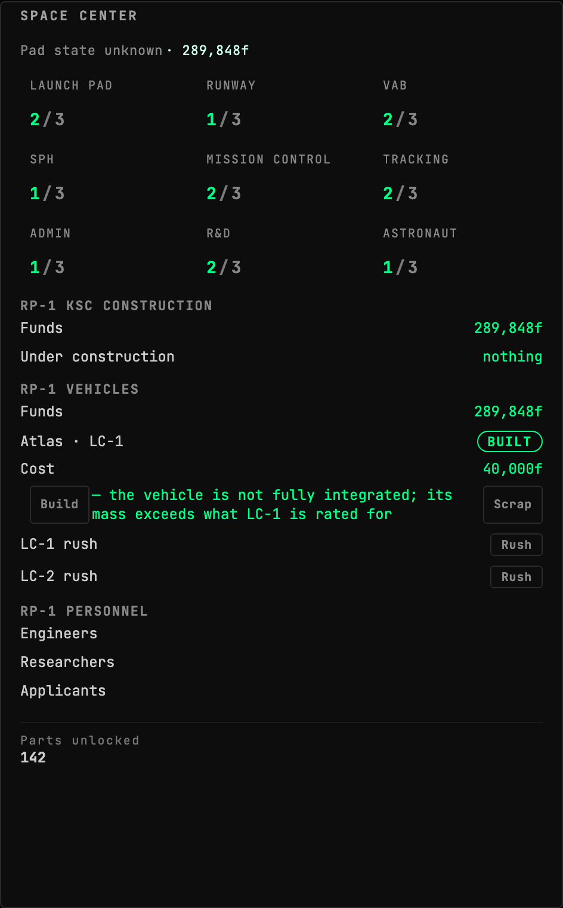

<!-- Generated by `gonogo-uplink docs`. Do not edit this file: edit
     `uplink.md` for the prose, and the registrations for everything else. -->

# RP-1

Brings [RP-1](https://github.com/KSP-RO/RP-0)'s career layer to the dashboard:
Programs with their objectives, deadlines and funding curves, the Confidence
price and term at each speed, and the per-year funding summary those payments
follow.

RP-1's career is a schedule, not a scoreboard. A Program pays on a curve, costs
Confidence at a rate that depends on the speed you picked, and expires on a date.
Those four facts decide what to launch next and none of them is legible from a
single number, so the widget shows the whole Program rather than a balance.

## Simulations and light-time

RP-1 simulations are exempt from signal delay by default, and off is the honest
reading: a simulation is a ground-side rehearsal with no spacecraft, so there is
no light-time, and delaying it models a distance to a craft that is not there.

The setting exists for the case where you want the rehearsal to have the
conditions of the real flight. It is enforced by the mod rather than by this
console, so turning it on applies to withheld telemetry and to every command
alike, not just to what the dashboard chooses to grey out.

The mod half never links RP-0's assembly and never derives from its types. Every
RP-1 member is reached by runtime reflection, which keeps this assembly clear of
RP-1's NonCommercial ShareAlike terms; RP-1's attribution notice ships beside the
plugin in `NOTICE-RP1.txt`.

## Install

Needs [RP-1](https://github.com/KSP-RO/RP-0) and the Realism Overhaul stack it
sits on, and a career save. With RP-1 absent the Uplink loads, publishes nothing,
and the widgets say so rather than showing an empty career.

| | |
| --- | --- |
| Uplink id | `rp1` |
| Version | `0.0.1` |
| Built against | contract 13.2, api 1.0.0, ui-kit 0.2.0 |

## What it puts on the wire

Reflected out of this Uplink's own contract assembly by the codegen that writes `src/__generated__/`, so it describes the C# declaration itself rather than a second copy of it. Each field is followed by its declared unit (a lowercase token from the wire vocabulary) or, where it holds another payload, that payload's name.

### Channels

| Channel | Payload | Fields |
| --- | --- | --- |
| `rp1.buildQueue` | `Rp1BuildItemEntry[]` | `cost` funds, `humanRated` flag, `id` id, `kscName` id, `launchSite` id, `lcId` id, `mass` t, `progress` bp, `progressRatio` ratio, `projectType` enum, `rate` bp/s, `shipId` id, `shipName` text, `stalled` flag, `timeLeftSeconds` s, `totalPoints` bp |
| `rp1.centres` | `Rp1CentreEntry[]` | `anyOperational` flag, `engineers` count, `groundStation` id, `isActive` flag, `kscName` id, `launchComplexCount` count, `unassignedEngineers` count |
| `rp1.complexes` | `Rp1ComplexEntry[]` | `canIntegrate` flag, `efficiency` ratio, `engineers` count, `humanRated` flag, `isOperational` flag, `isRushing` flag, `kscName` id, `lcId` id, `lcType` enum, `massMax` t, `massMin` t, `maxEngineers` count, `name` text, `rate` bp/s |
| `rp1.confidence` | `Rp1Confidence` | `confidence` confidence, `earned` confidence |
| `rp1.constructions` | `Rp1ConstructionEntry[]` | `cost` funds, `currentLevel` count, `engineersToReadd` count, `facilityType` enum, `isModify` flag, `kind` enum, `kscName` id, `lcId` id, `name` text, `padId` id, `progress` bp, `progressRatio` ratio, `rate` bp/s, `spentCost` funds, `spentRushCost` funds, `stalled` flag, `targetLevel` count, `timeLeftSeconds` s, `totalPoints` bp, `workRate` ratio |
| `rp1.crew` | `Rp1CrewEntry[]` | `latestRetiresAtUt` ut, `name` id, `nextTrainingExpiryTarget` text, `nextTrainingExpiryUt` ut, `retired` flag, `retirementExtensionUsedSeconds` s, `retiresAtUt` ut, `trainingCourse` text, `trainingExpiryCount` count, `trainingFinishesAtUt` ut, `trainingFractionComplete` ratio, `trainingStarted` flag, `trainingTarget` text, `trainingType` text |
| `rp1.crewProgram` | `Rp1CrewProgram` | `courses` count, `coursesStarted` count, `crewInTraining` count, `crewRnREnabled` flag, `missionTrainingEnabled` flag, `missionTrainingRate` 1, `proficiencyTrainingRate` 1, `retirementEnabled` flag, `retirementExtensionCapSeconds` s |
| `rp1.operations` | `Rp1OperationEntry[]` | `associatedVesselId` id, `blockingPeers` count, `cost` funds, `kscName` id, `launchPadId` id, `lcId` id, `progress` bp, `progressRatio` ratio, `rate` bp/s, `stalled` flag, `timeLeftSeconds` s, `totalPoints` bp, `type` enum |
| `rp1.pads` | `Rp1PadEntry[]` | `fractionalLevel` ratio, `hasVesselWaiting` flag, `kscName` id, `launchSiteName` id, `lcId` id, `level` count, `name` text, `padId` id, `state` enum, `waitingVesselName` text |
| `rp1.personnel` | `Rp1Personnel` | `applicants` count, `researchers` count, `totalEngineers` count |
| `rp1.programFundingCurves` | `Rp1FundingCurveEntry[]` | `isDefault` flag, `keys` Rp1FundingCurveKey[], `name` id |
| `rp1.programSlots` | `Rp1ProgramSlots` | `activeCount` count, `completedCount` count, `freeSlots` count, `maxSlots` count, `usedSlots` count |
| `rp1.programs` | `Rp1ProgramEntry[]` | `acceptedUt` ut, `canAccept` flag, `canComplete` flag, `completedUt` ut, `confidenceCost` confidence, `deadlineUt` ut, `durationSeconds` s, `fracElapsed` ratio, `fundingCurve` text, `fundingPayments` Rp1ProgramPaymentEntry[], `fundsPaidOut` funds, `fundsRemaining` funds, `isHumanSpaceflight` flag, `lastPaymentUt` ut, `name` id, `nominalDurationSeconds` s, `objectivesCompletedUt` ut, `objectivesMet` flag, `objectivesText` text, `programsToDisableOnAccept` id, `repDeltaOnCompletePerYearEarly` rep, `repPenaltyAssessed` rep, `repPenaltyPerYearLate` rep, `requirementsMet` flag, `requirementsText` text, `slots` count, `speed` enum, `speedOptions` Rp1ProgramSpeedOption[], `state` enum, `title` text, `totalFunding` funds |
| `rp1.research` | `Rp1ResearchEntry[]` | `endYear` count, `progress` count, `progressRatio` ratio, `rate` count, `scienceCost` count, `stalled` flag, `startYear` count, `techId` id, `techName` text, `timeLeftSeconds` s, `workRate` ratio |
| `rp1.warehouse` | `Rp1WarehouseItemEntry[]` | `cost` funds, `humanRated` flag, `id` id, `kscName` id, `launchSite` id, `lcId` id, `mass` t, `projectType` enum, `rolloutRefusals` text, `shipId` id, `shipName` text |

### Payloads held inside another payload

Reached through a channel above rather than by subscribing to one: a field named in the tables so far holds one of these, either singly, as a list (`[]`) or as a string-keyed dictionary (`*`). Their own fields carry declared units too, which is the reason they are listed: a quantity nested two deep is still a quantity.

| Payload | Fields |
| --- | --- |
| `Rp1FundingCurveKey` | `frac` ratio, `inTangent` 1, `outTangent` 1, `paidFraction` ratio |
| `Rp1ProgramPaymentEntry` | `cumulativeFunds` funds, `funds` funds, `year` count |
| `Rp1ProgramSpeedOption` | `confidenceCost` confidence, `durationSeconds` s, `speed` enum |

### Command args, dynamic channels and extensions

Wire shapes whose route onto the wire is not in the generated slice, so the honest description is all three things one of these can be: a command's arguments, the payload of a dynamic namespace whose topic string is composed at runtime (per vessel, per part, per CPU), or a namespace this Uplink adds inside another channel's extensions bag. None of the three is a fixed name an attribute could declare, which is why they are listed by shape.

| Payload | Fields |
| --- | --- |
| `Rp1BuildRepeatArgs` | `id` id |
| `Rp1ComplexRushArgs` | `lcId` id, `rushing` flag |
| `Rp1RolloutArgs` | `id` id, `pad` id |
| `Rp1VehicleArgs` | `id` id |

## Widgets

### RP-1 Program Detail

One RP-1 Program in full: its objectives, the funds it pays and has paid, its deadline, the Confidence price and term at each speed, the per-year funding summary, and the funding curve those payments follow.

- Widget id: `rp1-program-detail`
- Needs: `rp1.available`, `rp1.programs`, `rp1.programSlots`, `rp1.programFundingCurves`, `rp1.confidence`, `career.status`
- Default size: 8 x 16 grid units

*A Program whose funding curve RP-1 has not published: the chart refuses to draw and says so, rather than drawing zero*

*A Program whose funding curve RP-1 has not published: the chart refuses to draw and says so, rather than drawing zero*

*A Program whose funding curve RP-1 has not published: the chart refuses to draw and says so, rather than drawing zero*

*A Program whose funding curve RP-1 has not published: the chart refuses to draw and says so, rather than drawing zero*

*A Program whose funding curve RP-1 has not published: the chart refuses to draw and says so, rather than drawing zero*

*An offer the career cannot yet afford at any paid speed, with the front-loaded curve that would fund its first two years*

*An offer the career cannot yet afford at any paid speed, with the front-loaded curve that would fund its first two years*

*An offer the career cannot yet afford at any paid speed, with the front-loaded curve that would fund its first two years*

*An offer the career cannot yet afford at any paid speed, with the front-loaded curve that would fund its first two years*

*An offer the career cannot yet afford at any paid speed, with the front-loaded curve that would fund its first two years*

*A running Program part paid, on a strongly back-loaded curve: the chart is why the total alone cannot be planned against, almost none of this money arrives before the fourth year*

*A running Program part paid, on a strongly back-loaded curve: the chart is why the total alone cannot be planned against, almost none of this money arrives before the fourth year*

*A running Program part paid, on a strongly back-loaded curve: the chart is why the total alone cannot be planned against, almost none of this money arrives before the fourth year*

*A running Program part paid, on a strongly back-loaded curve: the chart is why the total alone cannot be planned against, almost none of this money arrives before the fourth year*

*A running Program part paid, on a strongly back-loaded curve: the chart is why the total alone cannot be planned against, almost none of this money arrives before the fourth year*

## Sections added to other widgets

### `rp1-crew-schedule` into `astronaut-complex.crew`

- Reads: none

> No preview: no fixture names this augment. An augment that draws in its host's own coordinate space (a map projection, an SVG transform) cannot honestly be shown in a stand-in panel, which has nothing to draw against; one that renders ordinary content can gain a preview by adding a fixture.

### `rp1-crew-programme` into `astronaut-complex.sections`

- Reads: none

> No preview: no fixture names this augment. An augment that draws in its host's own coordinate space (a map projection, an SVG transform) cannot honestly be shown in a stand-in panel, which has nothing to draw against; one that renders ordinary content can gain a preview by adding a fixture.

### `rp1-ksc-construction` into `space-center-status.sections`

- Reads: none

> Rendered in a STAND-IN host panel: the real host widget ships with the app and an Uplink may not import it, so the section's own layout is faithful and how it sits under the host's rows is not shown.

*A modification, which takes the complex out of service and idles its engineers: the one row whose detail line is a warning rather than a label*

*Nothing queued, which is where a career starts: the section has to read as an answer rather than as one that failed to draw*

> Empty by design: a fresh career has nothing under construction, and this is the picture of that state reading as an answer

*The state a first-decade RP-1 career sits in: a VAB upgrade, a second launch complex and a pad all building at once, appended under the space centre's own facility list*

*A construction RP-1 has not priced yet, a real state on a freshly loaded save, proving it does not read as stalled*

*The two clock states that are not an ETA, side by side: money being spent faster on purpose, and a throttle wound shut*

### `rp1-ksc-vehicles` into `space-center-status.sections`

- Reads: none

> Rendered in a STAND-IN host panel: the real host widget ships with the app and an Uplink may not import it, so the section's own layout is faithful and how it sits under the host's rows is not shown.

*Nothing built and nothing on order, which is where a career starts*

> Empty by design: a fresh career has no vehicles built and none ordered, and this is the picture of that state reading as an answer

*The repeat-build surface in the state it is used in: two vehicles of the SAME design, one flown-ready and one still integrating*

*A vehicle mid-rollout, the state the whole rollout and rollback pair exists for: four controls plus a badge and an ETA share one row, and that row is the first place this section runs out of width*

*A vehicle RP-1 will not roll out, and why in its own words: the controls are absent and the refusals are the one thing a missing button cannot say for itself*

### `rp1-launch-complex-status` into `launch-director.preflight`

- Reads: none

> No preview: no fixture names this augment. An augment that draws in its host's own coordinate space (a map projection, an SVG transform) cannot honestly be shown in a stand-in panel, which has nothing to draw against; one that renders ordinary content can gain a preview by adding a fixture.

### `rp1-program-status` into `career-economy.sections`

- Reads: none

> No preview: no fixture names this augment. An augment that draws in its host's own coordinate space (a map projection, an SVG transform) cannot honestly be shown in a stand-in panel, which has nothing to draw against; one that renders ordinary content can gain a preview by adding a fixture.

### `rp1-research-queue` into `tech-tree.sections`

- Reads: none

> No preview: no fixture names this augment. An augment that draws in its host's own coordinate space (a map projection, an SVG transform) cannot honestly be shown in a stand-in panel, which has nothing to draw against; one that renders ordinary content can gain a preview by adding a fixture.

### `rp1-space-centre-personnel` into `space-center-status.sections`

- Reads: none

> No preview: no fixture names this augment. An augment that draws in its host's own coordinate space (a map projection, an SVG transform) cannot honestly be shown in a stand-in panel, which has nothing to draw against; one that renders ordinary content can gain a preview by adding a fixture.

## What other mods can extend in this Uplink

Every widget above carries the framework's universal segments (`badges`, `filters`, `meters`), so another mod can add a badge, a filter or a meter to any of them without this Uplink declaring anything. They are not listed per widget: they are the floor every widget stands on, not this Uplink's own extension surface.

## What this page cannot tell you

- which topic each of the 4 shapes under
  "Command args, dynamic channels and extensions" travels on. A dynamic
  namespace composes its topic per subject at runtime and an extensions
  bag has no topic of its own, so there is no fixed name for the codegen
  to reflect; the mod's own channel constants are where those strings live
- which commands the Uplink accepts, and each one's DELAY ROLE. Both are
  declared where the mod registers them rather than as an attribute on a
  payload, and the client sends a command by naming it at the call site,
  so neither half of the build can enumerate them
- capabilities the mod half declares, which are registered imperatively
  rather than as a field, so nothing can enumerate them
- what a widget DOES, as opposed to what it reads. That is the one thing
  only its author can write, and `uplink.md` is where it goes

