<!-- Generated by `gonogo-uplink docs`. Do not edit this file: it is written
     from the registrations, the contract slice and the fixtures. -->

# RP-1

Brings RP-1's career layer to the dashboard: Programs with their objectives, deadlines, funding curves and the Confidence price at each speed.

| | |
| --- | --- |
| Uplink id | `rp1` |
| Version | `0.0.1` |
| Built against | contract 13.2, api 1.0.0, ui-kit 0.2.0 |

## Wire

| Topic | Payload | Delivery | Delay |
| --- | --- | --- | --- |
| `rp1.buildQueue` | `Rp1BuildItemEntry[]` | lossy-latest | true-now |
| `rp1.centres` | `Rp1CentreEntry[]` | lossy-latest | true-now |
| `rp1.complexes` | `Rp1ComplexEntry[]` | lossy-latest | true-now |
| `rp1.confidence` | `Rp1Confidence` | lossy-latest | true-now |
| `rp1.constructions` | `Rp1ConstructionEntry[]` | lossy-latest | true-now |
| `rp1.crew` | `Rp1CrewEntry[]` | lossy-latest | true-now |
| `rp1.crewProgram` | `Rp1CrewProgram` | lossy-latest | true-now |
| `rp1.operations` | `Rp1OperationEntry[]` | lossy-latest | true-now |
| `rp1.pads` | `Rp1PadEntry[]` | lossy-latest | true-now |
| `rp1.personnel` | `Rp1Personnel` | lossy-latest | true-now |
| `rp1.programFundingCurves` | `Rp1FundingCurveEntry[]` | lossy-latest | true-now |
| `rp1.programSlots` | `Rp1ProgramSlots` | lossy-latest | true-now |
| `rp1.programs` | `Rp1ProgramEntry[]` | lossy-latest | true-now |
| `rp1.research` | `Rp1ResearchEntry[]` | lossy-latest | true-now |
| `rp1.warehouse` | `Rp1WarehouseItemEntry[]` | lossy-latest | true-now |
| `rp1.available` | – | lossy-latest | true-now |

| Payload | Fields |
| --- | --- |
| `Rp1BuildRepeatArgs` | `id` id |
| `Rp1ComplexRushArgs` | `lcId` id, `rushing` flag |
| `Rp1FundingCurveKey` | `frac` ratio, `inTangent` 1, `outTangent` 1, `paidFraction` ratio |
| `Rp1ProgramPaymentEntry` | `cumulativeFunds` funds, `funds` funds, `year` count |
| `Rp1ProgramSpeedOption` | `confidenceCost` confidence, `durationSeconds` s, `speed` enum |
| `Rp1RolloutArgs` | `id` id, `pad` id |
| `Rp1VehicleArgs` | `id` id |

## Widgets

### RP-1 Program Detail

One RP-1 Program in full: its objectives, the funds it pays and has paid, its deadline, the Confidence price and term at each speed, the per-year funding summary, and the funding curve those payments follow.

| | |
| --- | --- |
| Widget id | `rp1-program-detail` |
| Reads | `rp1.available`, `rp1.programs`, `rp1.programSlots`, `rp1.programFundingCurves`, `rp1.confidence`, `career.status` |
| Default size | 8 × 16 |

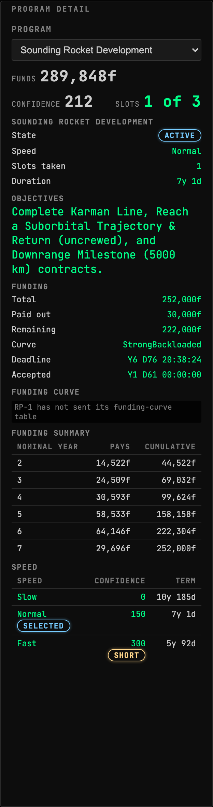

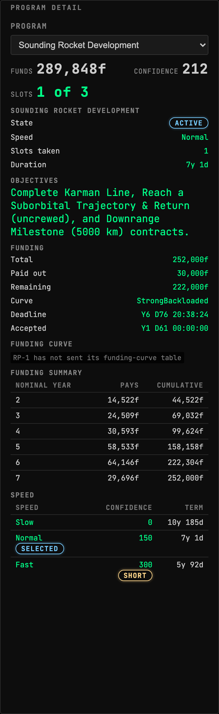

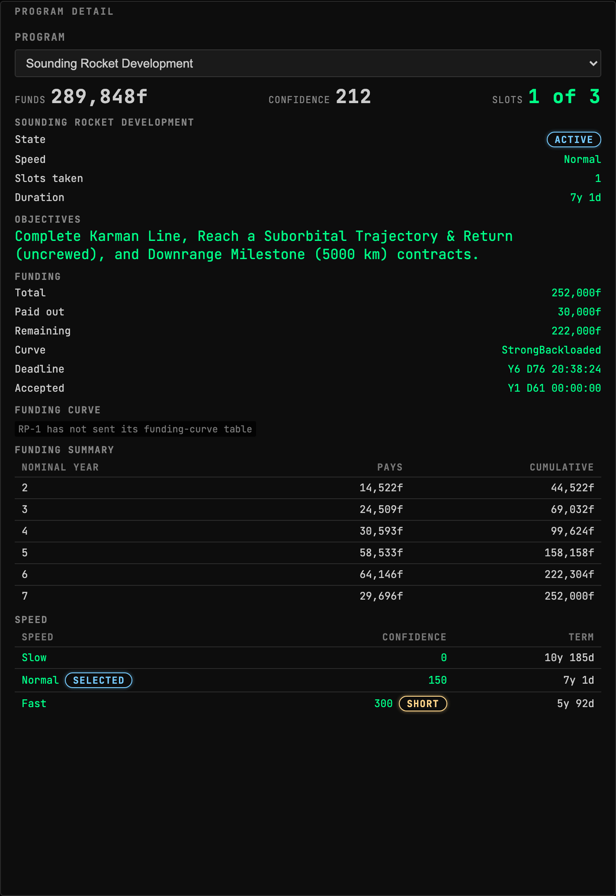

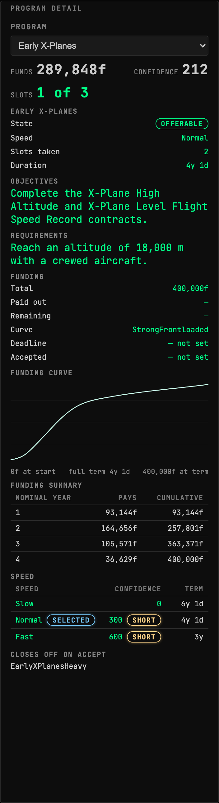

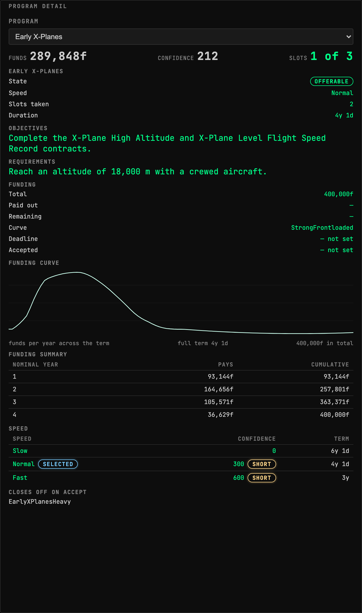

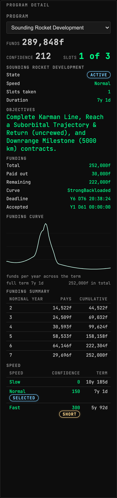

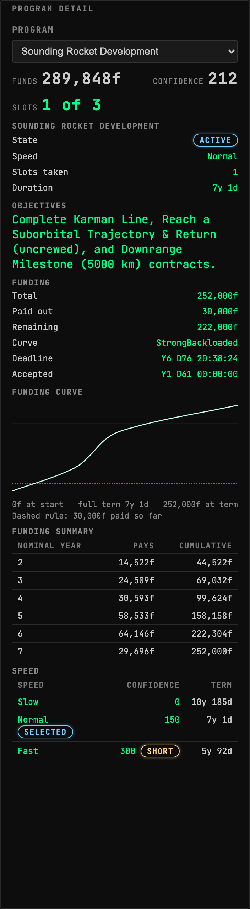

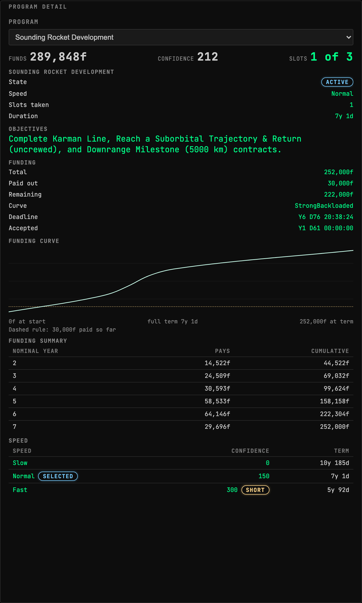

### RP-1 Personnel

RP-1's payroll: engineers, researchers and applicants on the books, each centre's unassigned engineers, and the crew, efficiency and rush state of every launch complex they are assigned to.

| | |
| --- | --- |
| Widget id | `rp1-space-centre-personnel` |
| Reads | `rp1.available`, `rp1.personnel`, `rp1.centres`, `rp1.complexes` |
| Default size | 6 × 9 |

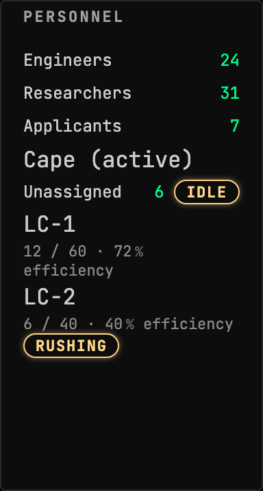

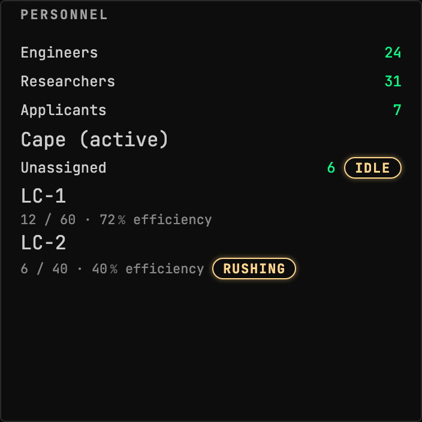

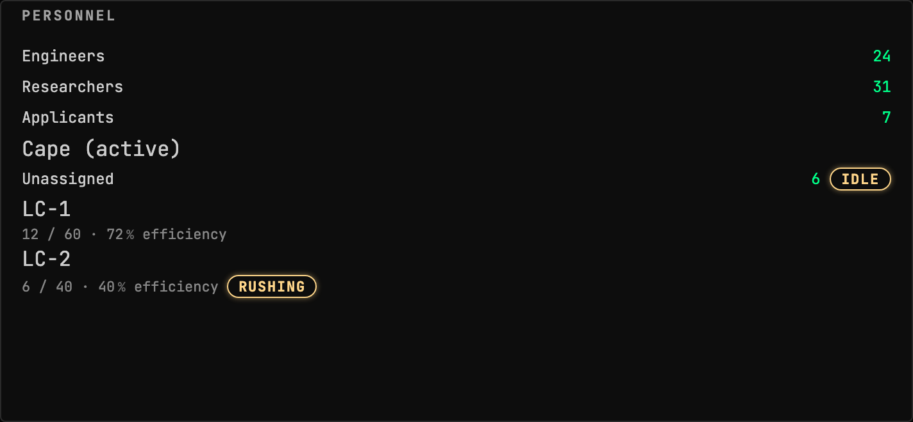

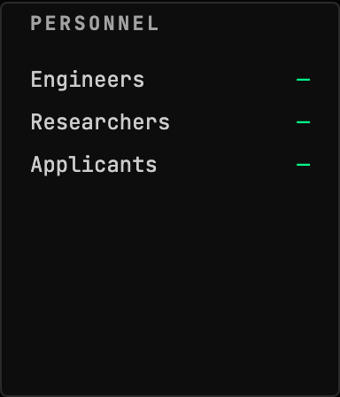

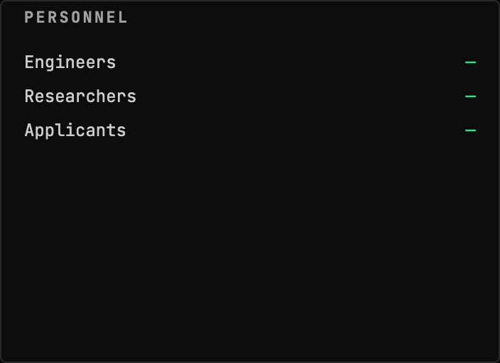

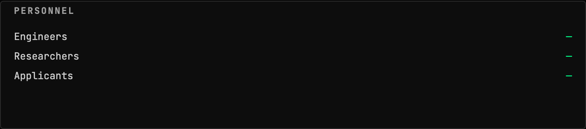

### Vehicle Assembly

Every craft RP-1 is integrating or holding, across every launch complex at every space centre: what it costs, how far along it is, why its clock reads what it reads, and the controls to roll one out, bring it back or scrap it.

| | |
| --- | --- |
| Widget id | `rp1-vehicle-assembly` |
| Reads | `rp1.available`, `rp1.warehouse`, `rp1.buildQueue`, `rp1.complexes`, `rp1.pads`, `rp1.operations`, `career.status` |
| Slots | `rp1-vehicle-assembly.sections` |
| Default size | 7 × 16 |

## Augments

| Augment | Into | Reads | Presence | Notes |
| --- | --- | --- | --- | --- |
| `rp1-crew-schedule` | `astronaut-complex.crew` | – |  |  |
| `rp1-crew-programme` | `astronaut-complex.sections` | – |  |  |
| `rp1-ksc-complexes` | `space-center-status.sections` | – |  |  |
| `rp1-ksc-construction` | `space-center-status.sections` | – |  |  |
| `rp1-launch-complex-status` | `launch-director.pad` | – |  |  |
| `rp1-program-status` | `career-economy.sections` | – |  |  |
| `rp1-research-queue` | `tech-tree.sections` | – |  |  |
| `rp1-vehicle-assembly-building` | `rp1-vehicle-assembly.sections` | – |  |  |
| `rp1-vehicle-assembly-warehouse` | `rp1-vehicle-assembly.sections` | – |  |  |

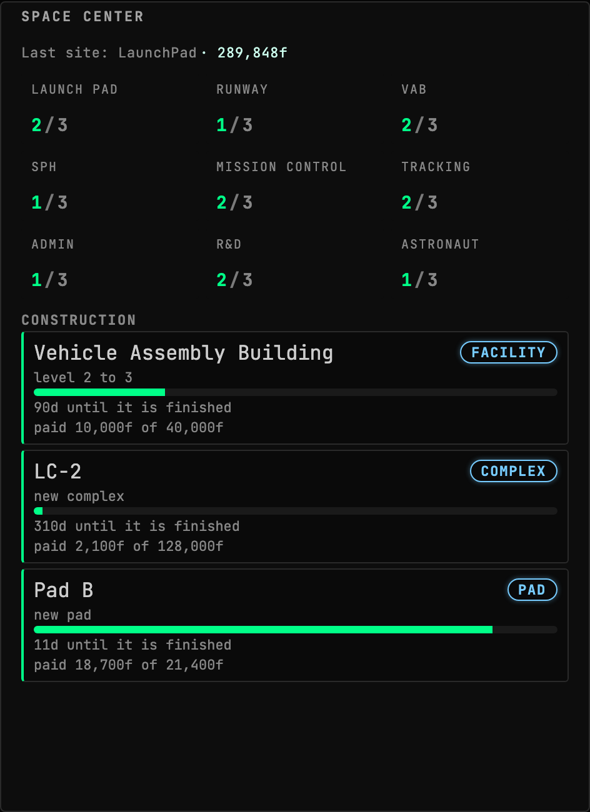

